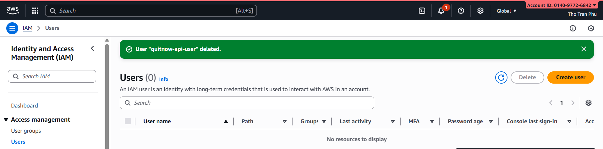
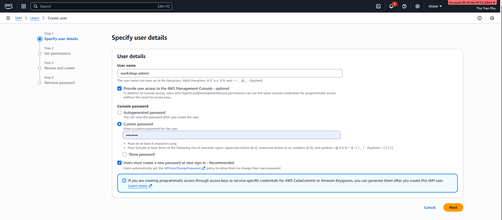

# Module 2: Prerequisites - Chuẩn Bị Tài Khoản & Tools

## Mục tiêu Module

- Tạo & cấu hình AWS account
- Thiết lập IAM roles & policies
- Verify quyền truy cập cần thiết
- Setup cost monitoring & alerts

---

## Phần 1: AWS Account Setup

### Bước 1: Tạo AWS Account

Nếu chưa có AWS account:

1. Truy cập https://aws.amazon.com/
2. Click "Create an AWS Account"
3. Điền email, password, account name
4. Chọn Support Plan (Free tier available)
5. Verify email & setup billing information


### Bước 2: Login vào AWS Console

1. Truy cập https://console.aws.amazon.com/
2. Nhập root account email & password
3. Verify MFA (Multi-Factor Authentication) nếu được yêu cầu

**Note**: Nên bật MFA cho root account để bảo mật

---

## Phần 2: IAM Setup - Tạo Admin User

### Bước 1: Truy cập IAM Dashboard

1. Từ AWS Console, tìm kiếm "IAM"
2. Click "IAM" từ services list
3. Click "Users" trong navigation menu



### Bước 2: Tạo IAM User cho Workshop

1. Click "Create user"
2. Nhập User name: "workshop-admin"
3. Check "Provide user access to the AWS Management Console - optional"
4. Check "Users must create a new password at next sign-in - Recommended"
5. Click "Next"



### Bước 3: Gán Permissions

1. Chọn "Attach policies directly"
2. Tìm và check policies sau:
   - AdministratorAccess (cho phép toàn bộ services)


3. Click "Next"


### Bước 4: Review & Create

1. Review thông tin user
2. Click "Create user"
3. Download ".csv" file chứa credentials


### Bước 5: Login bằng IAM User

1. Copy User sign-in link từ confirmation screen
2. Mở link trong browser mới
3. Login bằng user name &  password
 


---

## Phần 3: Verify Permissions

### Kiểm tra quyền truy cập AWS Services

1. Login vào AWS Console bằng IAM user
2. Truy cập từng service để verify quyền:
   - Cognito: https://console.aws.amazon.com/cognito/
   - Lambda: https://console.aws.amazon.com/lambda/
   - EC2: https://console.aws.amazon.com/ec2/
   - API Gateway: https://console.aws.amazon.com/apigateway/
   - S3: https://console.aws.amazon.com/s3/
   - VPC: https://console.aws.amazon.com/vpc/

**Kiểm tra**: Bạn nên thấy "Create application" (không phải error message)


---

## Phần 4: Resources Naming Convention

Để quản lý resources dễ dàng, sử dụng naming convention:

```
{project-name}-{service}-{environment}
```

Examples:
- smoking-cessation-cognito-dev
- smoking-cessation-lambda-auth-dev
- smoking-cessation-db-pg-dev (PostgreSQL on EC2)
- smoking-cessation-db-mongo-dev (MongoDB on EC2)
- smoking-cessation-api-dev
- smoking-cessation-frontend-dev
- smoking-cessation-vpc-dev

**Benefit**: Dễ tìm kiếm & quản lý resources trong console

## Troubleshooting

### Không thể tạo IAM User

- Kiểm tra: Bạn đã login bằng root account hay IAM user khác?
- Solution: Login lại bằng root account để tạo IAM user

### Permission Denied errors

- Verify: IAM policies attached to user
- Kiểm tra: Policies có include service bạn đang sử dụng không?
- Contact AWS support nếu cần elevated permissions

---

## Notes

- Từ bây giờ, tất cả actions đều sử dụng IAM user, không phải root
- Mỗi service sẽ có specific IAM role (created ở modules tiếp theo)
- Free Tier cung cấp sufficient resources cho learning

---

## Kết Quả Đạt Được

Sau Module 2, bạn sẽ có:

1. AWS account đã activate
2. IAM user "workshop-admin" có quyền admin
3. Quyền truy cập tất cả AWS services cần thiết
4. Sẵn sàng cho Module 3 (Setup Cognito)
