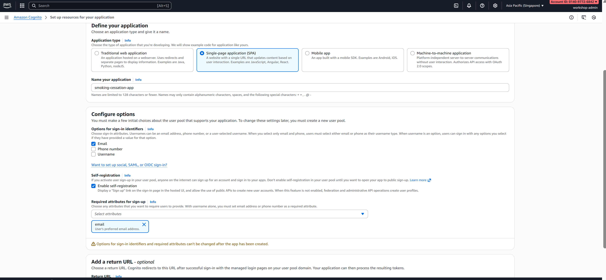

# Module 3: Create Cognito User Pool & Authentication

## Mục tiêu Module

- Tạo Cognito User Pool mới
- Cấu hình Sign-up & Sign-in options
- Tạo App Client cho frontend
- Thiết lập User Groups (admin, coach, user)
- Tạo test users
- Test authentication flow

**Duration**: 3-4 giờ

---

## Phần 1: Tạo Cognito User Pool

### Bước 1: Truy cập Cognito Console

1. Login vào AWS Console (https://console.aws.amazon.com/)
2. Tìm kiếm "Cognito"
3. Click vào "Cognito" từ services list
4. Click "User pools" (left menu)
5. Click "Create user pool"


### Bước 2: Điền "Set up resources for your application"

Sau khi click "Create user pool", bạn sẽ thấy form "Set up resources for your application":

#### **2.1 Define your application**

1. **Application type**: Chọn **"Single-page application (SPA)"**
   - Đây là loại ứng dụng React của bạn
2. **Name your application**: Nhập `smoking-cessation-app`
   - Giới hạn: 128 ký tự, chỉ chứa chữ, số, spaces, +, =, ,, ., @, -

#### **2.2 Options for sign-in identifiers**

Chọn các tùy chọn này:
- ☑️ **Email** (Check)
- ☐ Phone number (Uncheck)
- ☐ Username (Uncheck)

**Lý do**: Email là cách đơn giản nhất để users đăng nhập

#### **2.3 Self-registration**

- ☑️ **Enable self-registration** (Check)
  - Điều này cho phép users tự đăng ký trên platform
  - Sẽ hiển thị link "Sign up" trên login page

#### **2.4 Required attributes for sign-up**

Chọn các attributes bắt buộc:
- ☑️ **email** (Already checked vì bạn selected Email for sign-in)
- ☑️ **name** (Check - lưu tên người dùng)

#### **2.5 Add a return URL (optional)**

1. Click vào field "Return URL"
2. Nhập: `https://localhost:3000/callback`
   - Đây là nơi Cognito sẽ redirect sau khi login thành công
   - **Note**: For development, localhost hỗ trợ HTTP; for production, phải là HTTPS

3. Sau khi điền xong, click **"Create user directory"** button ở dưới



### Bước 3: Configure Security Requirements

Sau khi click "Authentication methods", bạn sẽ đến trang "Authentication methods":

1. **Password policy**:
   - Chon Cognito defaults trong **Password policy mode**

2. **Edit email configuration**:
   - Chọn **Send email with Cognito** trong  Email provider
   - Bấm **Save changes**

3. **Account recovery**:
   - Self-service account recovery: ☑️ **Enable**
   - Recovery method:
     - ☑️ Email
     - ☑️ SMS


### Bước 4: Configure Sign-up Experience

Trang "Configure sign-up experience":

1. **Self-registration** (đã bật ở bước 2):
   - Enable self-registration: ✅ **Yes**
   - Allow users to sign themselves up: ✅ **Yes**

2. **Standard attributes to collect**:
   - ☑️ **email** (Required)
   - ☑️ **name** (Required)
   - ☐ phone_number (Optional - không cần)
   - ☐ family_name (Optional - không cần)

3. **Verification settings**:
   - How will a user be confirmed?: **Email**
   - Cognito sẽ gửi confirmation link qua email

4. Click **"Next"**


### Bước 5: Configure Message Delivery

Trang "Configure message delivery":

1. **Email provider**:
   - Select: **Cognito (default)**
   - Note: Free tier cho phép 50 emails/ngày. Cho production, sử dụng Amazon SES.

2. **From email address**:
   - Use Cognito default email
   - Emails sẽ gửi từ `no-reply@cognito.amazonaws.com`

3. Click **"Next"**


### Bước 6: Review & Create

Trang cuối "Review and create":

1. Review tất cả settings bạn đã cấu hình:
   - Application type: Single-page application (SPA)
   - Application name: smoking-cessation-app
   - Sign-in experience
   - Security requirements
   - Sign-up experience
   - Message delivery

2. Scroll xuống, nhập **User pool name**:
   - Name: `smoking-cessation-users`
   - Đây là tên của User Pool (khác với Application name)

3. Click **"Create user pool"**


⏳ **Chờ khoảng 2-3 phút** để user pool được tạo. Bạn sẽ thấy success message khi xong.

### Bước 7: Success Page - Quick Setup Guide

Sau khi user pool được tạo, bạn sẽ thấy trang "Set up resources for your application" với các tùy chọn:


Trang này hiển thị:
1. **"Your application ... have been created successfully!"** - Thông báo thành công
2. **"Check out your sign-in page"** - Liên kết để test login page
3. **"What's the development platform for your single page application?"** - Các tùy chọn (React, Angular, JavaScript)
4. **Code examples** - Hướng dẫn tích hợp với frontend

**Lưu ý**: Bạn sẽ cấu hình code tích hợp ở Module tiếp theo. Bây giờ, hãy click **"Go to overview"** ở phía dưới để đi tới user pool overview page.


---

## Phần 2: Lấy User Pool ID

Sau khi user pool được tạo:

1. Bạn sẽ nhìn thấy success message
2. **Note lại User Pool ID**: Format là `ap-southeast-1_xxxxxxxxxxxxx`
   - Ví dụ: `ap-southeast-1_GAXOSoku5`
3. Lưu vào file `.env`:
   ```
   COGNITO_USER_POOL_ID=ap-southeast-1_dskxxxxt3
   COGNITO_REGION=ap-southeast-1
   ```


---

## Phần 3: Tạo App Client

### Bước 1: Truy cập App Integration

1. Từ User Pool dashboard (smoking-cessation-users)
2. Left menu: Click "App integration"
3. Click "App clients and analytics"
4. Click "Create app client"


### Bước 2: Configure App Client

1. **App client name**: `smoking-cessation-frontend`
2. **Refresh token expiration**: 30 days
3. **Access token expiration**: 1 hour (3600 seconds)
4. **ID token expiration**: 1 hour (3600 seconds)
5. **Token validity units**: hours
6. Click "Next"


### Bước 3: Configure Authentication Flows

1. **Authentication flows and security**
2. Select:
   - ✅ ALLOW_USER_PASSWORD_AUTH (for username/password login)
   - ✅ ALLOW_REFRESH_TOKEN_AUTH (for refresh token rotation)
   - ✅ ALLOW_USER_SRP_AUTH (secure password authentication)
3. Click "Next"


### Bước 4: Configure Hosted UI (Optional but Recommended)

1. **Hosted UI settings**
2. **Hosted UI domain name**: `smoking-cessation-dev`
   - Click "Check availability"
   - If taken, append `-{number}` (e.g., `smoking-cessation-dev-2`)
3. **Allowed callback URLs** (add for your frontend):
   - For development: `http://localhost:3000/callback`
   - For production: `https://yourdomain.com/callback`
4. **Allowed sign-out URLs**:
   - For development: `http://localhost:3000/logout`
   - For production: `https://yourdomain.com/logout`
5. **Allowed OAuth 2.0 scopes**:
   - ✅ openid
   - ✅ email
   - ✅ profile
6. Click "Next"


### Bước 5: Advanced Security Settings

1. **Advanced security settings**
2. **Prevent user existence errors**: ✅ **Enable**
   - This prevents attackers from discovering valid usernames
3. Click "Create app client"


⏳ **Chờ app client được tạo**

### Bước 6: Lấy App Client ID

Sau khi App Client được tạo:

1. Tìm **Client ID** ở phần app client details
   - Ví dụ: `4175kqc33olfjinhkll4jme379`
2. Lưu vào `.env`:
   ```
   COGNITO_CLIENT_ID=4175kqc33olfjinhkll4jme379
   ```


---

## Phần 4: Tạo User Groups

### Bước 1: Truy cập User Groups

1. Từ User Pool (smoking-cessation-users)
2. Left menu: Click "User groups"
3. Click "Create group"


### Bước 2: Tạo Admin Group

1. **Group name**: `admins`
2. **Description**: `Platform administrators with full access`
3. **Assign IAM role to this group**: (Optional, skip for now)
4. Click "Create group"


### Bước 3: Tạo Coach Group

1. Click "Create group"
2. **Group name**: `coaches`
3. **Description**: `Coaches who help users quit smoking`
4. Click "Create group"


### Bước 4: Tạo User Group

1. Click "Create group"
2. **Group name**: `users`
3. **Description**: `Regular users of the platform`
4. Click "Create group"


---

## Phần 5: Tạo Test Users

### Bước 1: Truy cập Users

1. Từ User Pool (smoking-cessation-users)
2. Left menu: Click "Users"
3. Click "Create user"


### Bước 2: Tạo Admin User

1. **Username**: `admin-test`
2. **Email address**: `admin@test.com`
3. **Temporary password**: `TempAdminPass123!`
4. **Mark email as verified**: ✅ **Check**
5. **Mark phone number as verified**: ☐
6. Click "Create user"


### Bước 3: Gán Admin User vào Admin Group

1. Click vào user `admin-test` vừa tạo
2. Scroll xuống "Group membership"
3. Click "Add user to groups"
4. Chọn `admins` group
5. Click "Add user to groups"


### Bước 4: Tạo Coach User

1. Trở về Users list
2. Click "Create user"
3. **Username**: `coach-test`
4. **Email address**: `coach@test.com`
5. **Temporary password**: `TempCoachPass123!`
6. **Mark email as verified**: ✅ **Check**
7. Click "Create user"


### Bước 5: Gán Coach User vào Coach Group

1. Click vào user `coach-test`
2. Scroll xuống "Group membership"
3. Click "Add user to groups"
4. Chọn `coaches` group
5. Click "Add user to groups"


### Bước 6: Tạo Regular User

1. Trở về Users list
2. Click "Create user"
3. **Username**: `user-test`
4. **Email address**: `user@test.com`
5. **Temporary password**: `TempUserPass123!`
6. **Mark email as verified**: ✅ **Check**
7. Click "Create user"
8. Gán vào `users` group (tương tự bước 5)


---

## Phần 6: Set Permanent Passwords (Optional)

Nếu bạn muốn users có thể đăng nhập ngay mà không cần đổi temporary password:

1. Từ Users list
2. Click vào user (e.g., `admin-test`)
3. Click "Actions" → "Set password"
4. **Permanent password**: `AdminPass123!`
5. **Make this permanent password**: ✅ **Check**
6. Click "Set password"


---

## Phần 7: Cấu hình App Client Thêm (Authentication Methods)

### Bước 1: Cấu hình App Client Details

1. Từ User Pool → App integration → App clients
2. Click vào `smoking-cessation-frontend`
3. Scroll down → "Client secret"
   - ⚠️ **Lưu ý**: Nếu bạn tạo Client Secret, frontend JavaScript không thể sử dụng được (vì không thể lưu secret an toàn trên client)
   - **Khuyến cáo**: Không tạo Client Secret cho public frontend
4. Leave "Client secret" as-is (không tạo)


---

## Phần 8: Enable Cognito Hosted UI (Optional)

### Bước 1: Cấu hình Hosted UI Domain

1. Từ User Pool → App integration → Domain name
2. If already configured → Skip
3. If not → Click "Create domain"
4. **Domain prefix**: `smoking-cessation-dev`
5. Click "Create domain"

⏳ **Chờ 1-2 phút** để domain được tạo

### Bước 2: Test Hosted UI

1. Từ App integration → App clients
2. Click vào `smoking-cessation-frontend`
3. Scroll xuống "Hosted UI settings"
4. Tìm **Hosted UI domain URL**:
   - Format: `https://smoking-cessation-dev.auth.us-east-1.amazoncognito.com`
5. Click link để open Hosted UI
6. Login test:
   - Username: `admin-test`
   - Password: `AdminPass123!`
   - Should redirect to `http://localhost:3000/callback` (or configured callback URL)


---

## Phần 9: Thông Tin Tóm Tắt

Lưu lại những thông tin này vào `.env` file:

```env
# Cognito Configuration
COGNITO_REGION=us-east-1
COGNITO_USER_POOL_ID=us-east-1_dskUsnKt3
COGNITO_CLIENT_ID=4175kqc33olfjinhkll4jme379
COGNITO_DOMAIN=smoking-cessation-dev
COGNITO_HOSTED_UI_DOMAIN=https://smoking-cessation-dev.auth.us-east-1.amazoncognito.com

# Test User Credentials (để remove trước production)
TEST_ADMIN_USER=admin-test
TEST_ADMIN_PASSWORD=AdminPass123!

TEST_COACH_USER=coach-test
TEST_COACH_PASSWORD=TempCoachPass123!

TEST_USER=user-test
TEST_USER_PASSWORD=TempUserPass123!
```


---

## Phần 10: Troubleshooting

### "Email already exists"

**Vấn đề**: Tạo user nhưng email đã tồn tại

**Giải pháp**:
1. Từ Users list
2. Tìm user với email đó
3. Delete nó (nếu test user)
4. Tạo user mới với email khác

### "Temporary password doesn't meet requirements"

**Vấn đề**: Password không đủ requirements

**Giải pháp**:
- Password phải:
  - Minimum 12 characters
  - Có uppercase (A-Z)
  - Có lowercase (a-z)
  - Có number (0-9)
  - Có special character (!@#$%^&*)
- Ví dụ hợp lệ: `TempPass123!`, `AdminTest456!`

### "Hosted UI domain not available"

**Vấn đề**: Domain đã bị dùng

**Giải pháp**:
- Thêm số vào suffix: `smoking-cessation-dev-2`
- Hoặc dùng tên khác

---

## Checklist

- [ ] User Pool "smoking-cessation-users" tạo thành công
- [ ] App Client "smoking-cessation-frontend" tạo thành công
- [ ] 3 User Groups created (admins, coaches, users)
- [ ] 3 test users created & assigned to groups
- [ ] Permanent passwords set for test users
- [ ] Hosted UI domain configured
- [ ] Login test successful with admin-test user
- [ ] .env file updated với Cognito credentials
- [ ] Sẵn sàng cho Module 4 (Setup Lambda)

---

## Kết Quả Đạt Được

Sau Module 3, bạn sẽ có:

1. ✅ Cognito User Pool hoạt động đầy đủ
2. ✅ App Client để frontend connect
3. ✅ User Groups (admins, coaches, users) cho role-based access control
4. ✅ Test users để verify authentication flow
5. ✅ Hosted UI domain có thể dùng cho login/signup
6. ✅ Credentials được lưu để dùng trong modules tiếp theo
