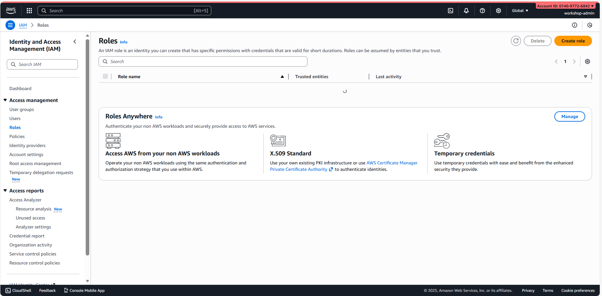
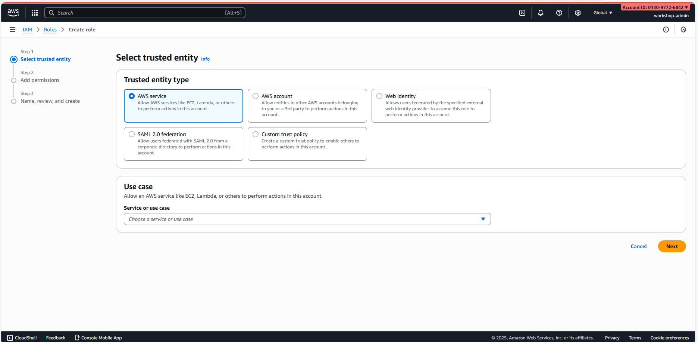
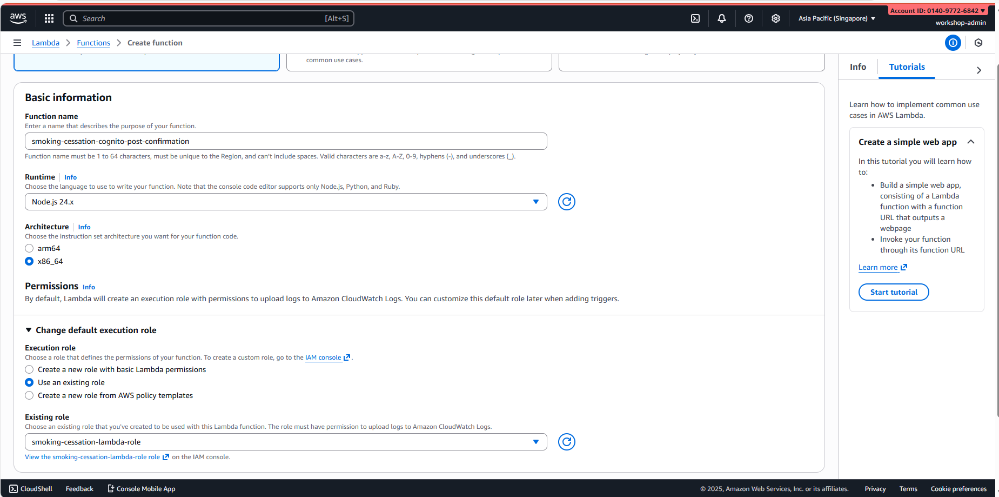
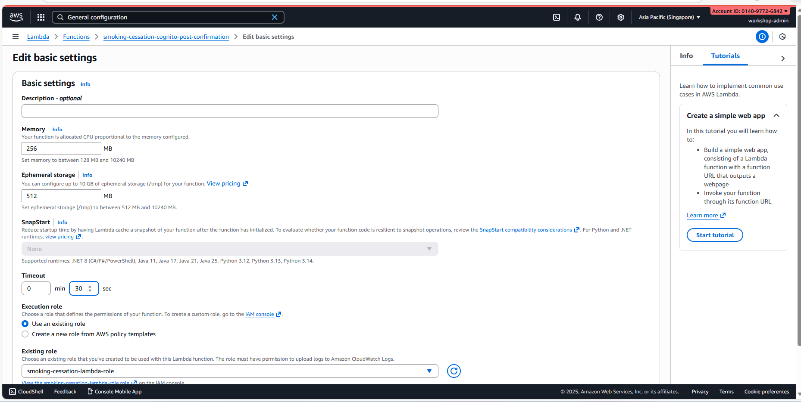
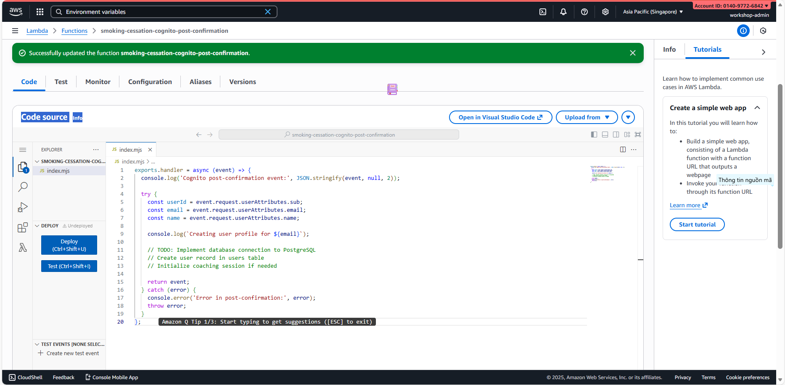

# Module 4: Create Lambda Functions

## Module Objectives

- Create 5 Lambda functions from scratch
- Configure IAM roles & permissions
- Set up environment variables
- Configure Cognito post-confirmation trigger
- Test Lambda functions
- Set up monitoring & alarms

**Duration**: 4–5 hours

---

## Lambda Functions Overview

The Lambda functions will handle specific events:

| Function | Region | Runtime | Purpose | Memory | Timeout |
|----------|--------|---------|---------|--------|---------|
| CognitoPostConfirmationTrigger | us-east-1 | nodejs20.x | Create user profile when user signs up | 256 MB | 30s |
| AdminManageCoachesFunction | ap-southeast-1 | nodejs20.x | Manage coaches (CRUD operations) | 512 MB | 30s |
| image-upload-lambda | ap-southeast-1 | nodejs20.x | Handle image uploads to S3 | 256 MB | 60s |
| leaflungs-websocket-authorizer | ap-southeast-1 | nodejs20.x | Authorize WebSocket connections | 256 MB | 30s |
| PaymentFunction | ap-southeast-1 | nodejs24.x | Process payments | 512 MB | 60s |

---

## Part 1: Create IAM Role for Lambda Functions

### Step 1: Access IAM Console

1. Login to AWS Console using IAM user
2. Search "IAM"
3. Click "IAM" from the services list
4. Left menu: Click "Roles"
5. Click "Create role"



### Step 2: Configure Trust Relationship

1. **Trusted entity type**: Select "AWS service"
2. **Service or use case**: Search and click "Lambda"
3. Click "Next"



### Step 3: Add Permissions

1. Search and check the following policies:
   - ✅ `AWSLambdaVPCAccessExecutionRole` (for EC2 database access)
   - ✅ `AWSLambdaBasicExecutionRole` (for CloudWatch logs)
   - ✅ `AmazonS3FullAccess` (for image upload function)
   - ✅ `SecretsManagerReadSecret` (for database credentials)
2. Click "Next"


### Step 4: Review & Create

1. **Role name**: `smoking-cessation-lambda-role`
2. **Description**: `Lambda execution role for smoking cessation platform`
3. Click "Create role"

⏳ **Wait for the role to be created**

### Step 5: Note Role ARN

1. Click the newly created role: `smoking-cessation-lambda-role`
2. Copy **Role ARN**: Format is `arn:aws:iam::014097726842:role/smoking-cessation-lambda-role`
3. Save it to use in later modules


---

## Part 2: Create Cognito Post-Confirmation Trigger (us-east-1)

### Step 1: Access Lambda Console

1. Login to AWS Console
2. Search "Lambda"
3. Click "Lambda" service
4. **Select region: us-east-1** (must match Cognito region)
5. Click "Create function"


### Step 2: Configure Function Basics

1. **Function name**: `smoking-cessation-cognito-post-confirmation`
2. **Runtime**: nodejs20.x
3. **Execution role**: Select "Use an existing role"
4. **Existing role**: `smoking-cessation-lambda-role` (from Part 1)
5. Click "Create function"

⏳ **Wait for the function to be created (about 1–2 minutes)**



### Step 3: Configure General Settings

1. Scroll to "General configuration"
2. Click "Edit"
3. **Memory**: 256 MB (default)
4. **Timeout**: 30 seconds
5. Click "Save"



### Step 4: Add Environment Variables

1. Scroll to "Environment variables"
2. Click "Edit"
3. Add the following variables:
PG_HOST = 172.0.8.55
PG_USER = postgres
PG_PASSWORD = (will set via Secrets Manager later)
PG_DATABASE = smoking_cessation
PG_PORT = 5432
COGNITO_USER_POOL_ID = (get from Module 3)
4. Click "Save"


### Step 5: Add Placeholder Code

1. Click the "Code" tab
2. In the code editor, replace everything with:

```javascript
exports.handler = async (event) => {
  console.log('Cognito post-confirmation event:', JSON.stringify(event, null, 2));

  try {
    const userId = event.request.userAttributes.sub;
    const email = event.request.userAttributes.email;
    const name = event.request.userAttributes.name;

    console.log(`Creating user profile for ${email}`);

    // TODO: Implement database connection to PostgreSQL
    // Create user record in users table
    // Initialize coaching session if needed

    return event;
  } catch (error) {
    console.error('Error in post-confirmation:', error);
    throw error;
  }
};
```

3. Click "Deploy"



### Bước 6: Add Cognito Trigger (Later)
**Note**: After deploying code, you will configure the Cognito trigger in Part 8.
---

## Part 3: Create Admin Manage Coaches Function (ap-southeast-1)

### Step 1: Switch to ap-southeast-1 Region

1. Top left: Click region dropdown
2. Select **ap-southeast-1**
3. Click "Create function"

### Step 2: Configure Function

1. **Function name**: `smoking-cessation-admin-manage-coaches`
2. **Runtime**: nodejs20.x
3. **Execution role**: `smoking-cessation-lambda-role`
4. Click "Create function"

⏳ **Wait for the function to be created**

### Step 3: Configure Settings

1. Click "Edit" in "General configuration"
2. **Memory**: 512 MB (for database operations)
3. **Timeout**: 30 seconds
4. Click "Save"

### Step 4: Add Environment Variables

1. Click "Edit" in "Environment variables"
2. Add:
PG_HOST = 172.0.8.55
PG_USER = postgres
PG_PASSWORD = (will set via Secrets Manager)
PG_DATABASE = smoking_cessation
API_REGION = ap-southeast-1
3. Click "Save"

### Step 5: Add Placeholder Code

```javascript
exports.handler = async (event) => {
console.log('Admin coaches request:', JSON.stringify(event, null, 2));

try {
 const httpMethod = event.httpMethod;
 const path = event.path;
 const body = event.body ? JSON.parse(event.body) : {};

 console.log(`${httpMethod} ${path}`);

 // TODO: Implement database operations
 // GET /admin/coaches - List all coaches
 // POST /admin/coaches - Create new coach
 // PUT /admin/coaches/{id} - Update coach
 // DELETE /admin/coaches/{id} - Delete coach
 // Include RBAC check (admin only)

 return {
   statusCode: 200,
   body: JSON.stringify({ message: 'Coaches function placeholder' })
 };
} catch (error) {
 console.error('Error:', error);
 return {
   statusCode: 500,
   body: JSON.stringify({ error: error.message })
 };
}
};
```
Click "Deploy"
---
## Part 4: Create Image Upload Lambda (ap-southeast-1)

### Step 1: Create Function
1. Click "Create function"
2. **Function name**: `smoking-cessation-image-upload`
3. **Runtime**: nodejs20.x
4. **Execution role**: `smoking-cessation-lambda-role`
5. Click "Create function"

### Step 2: Configure Settings
1. Click "Edit" in "General configuration"
2. **Memory**: 256 MB
3. **Timeout**: 60 seconds (because file upload may take time)
4. Click "Save"

### Step 3: Add Environment Variables
1. Click "Edit" in "Environment variables"
2. Add:
S3_BUCKET = smoking-cessation-images
S3_REGION = ap-southeast-1
MAX_FILE_SIZE = 10485760


3. Click "Save"

### Step 4: Add Placeholder Code
```javascript
exports.handler = async (event) => {
console.log('Image upload request:', JSON.stringify(event, null, 2));
try {
 const userId = event.requestContext.authorizer.claims.sub;
 const fileBuffer = Buffer.from(event.body, 'base64');
 const fileName = event.headers['x-filename'] || `image-${Date.now()}.jpg`;
 console.log(`Uploading ${fileName} for user ${userId}`);
 // TODO: Implement S3 upload
 // Validate file size (max 10MB)
 // Upload to S3 with user prefix
 // Generate pre-signed URL
 // Store reference in database
 const s3Url = `https://${process.env.S3_BUCKET}.s3.${process.env.S3_REGION}.amazonaws.com/${userId}/${fileName}`;
 return {
   statusCode: 200,
   body: JSON.stringify({ url: s3Url })
 };
} catch (error) {
 console.error('Error:', error);
 return {
   statusCode: 500,
   body: JSON.stringify({ error: error.message })
 };
}
};
Click "Deploy"


---

## Part 5: Create WebSocket Authorizer Lambda (ap-southeast-1)

### Step 1: Create Function

1. Click "Create function"
2. **Function name**: `smoking-cessation-websocket-authorizer`
3. **Runtime**: nodejs20.x
4. **Execution role**: `smoking-cessation-lambda-role`
5. Click "Create function"

### Step 2: Configure Settings

1. Click "Edit" in "General configuration"
2. **Memory**: 256 MB
3. **Timeout**: 30 seconds
4. Click "Save"

### Step 3: Add Environment Variables

1. Click "Edit" in "Environment variables"
2. Add:
COGNITO_USER_POOL_ID = (from Module 3)
COGNITO_CLIENT_ID = (from Module 3)
JWT_SECRET = (will be set via Secrets Manager)
3. Click "Save"

### Step 4: Add Placeholder Code

```javascript
exports.handler = async (event) => {
console.log('WebSocket authorization event:', JSON.stringify(event, null, 2));

try {
 const token = event.authorizationToken;

 if (!token) {
   throw new Error('No authorization token');
 }

 console.log('Validating WebSocket token');

 // TODO: Implement JWT token validation
 // Validate token signature
 // Check token expiration
 // Extract user ID from token

 // Placeholder authorization response
 return {
   principalId: 'user-id-placeholder',
   policyDocument: {
     Version: '2012-10-17',
     Statement: [
       {
         Action: 'execute-api:Invoke',
         Effect: 'Allow',
         Resource: event.methodArn
       }
     ]
   }
 };
} catch (error) {
 console.error('Authorization failed:', error);
 throw new Error('Unauthorized');
}
};
```
Click "Deploy"
---

## Part 6: Create Payment Function (ap-southeast-1)

### Step 1: Create Function

1. Click "Create function"
2. **Function name**: `smoking-cessation-payment`
3. **Runtime**: nodejs24.x (latest version)
4. **Execution role**: `smoking-cessation-lambda-role`
5. Click "Create function"

### Step 2: Configure Settings

1. Click "Edit" in "General configuration"
2. **Memory**: 512 MB (payment processing needs resources)
3. **Timeout**: 60 seconds
4. Click "Save"

### Step 3: Add Environment Variables

1. Click "Edit" in "Environment variables"
2. Add:
PG_HOST = 172.0.8.55
PG_USER = postgres
PG_PASSWORD = (will set via Secrets Manager)
PG_DATABASE = smoking_cessation
STRIPE_API_KEY = (will be set via Secrets Manager)
STRIPE_WEBHOOK_SECRET = (will be set via Secrets Manager)
PAYMENT_TABLE = payments
3. Click "Save"

### Step 4: Add Placeholder Code

```javascript
exports.handler = async (event) => {
 console.log('Payment event:', JSON.stringify(event, null, 2));

 try {
   const { userId, amount, paymentMethod, description } = JSON.parse(event.body);

   console.log(`Processing payment for user ${userId}: $${amount}`);

   // TODO: Implement payment processing
   // Validate amount
   // Process payment via Stripe/Payment gateway
   // Store payment record in database
   // Send confirmation email
   // Handle webhooks

   return {
     statusCode: 200,
     body: JSON.stringify({
       success: true,
       transactionId: `txn-${Date.now()}`,
       message: 'Payment processed successfully'
     })
   };
 } catch (error) {
   console.error('Payment error:', error);
   return {
     statusCode: 500,
     body: JSON.stringify({ error: error.message })
   };
 }
};
```
Click "Deploy"
---
## Part 7: Create Secrets Manager for Database Credentials

### Step 1: Access Secrets Manager

1. Search for "Secrets Manager"
2. Click the service
3. Click "Store a new secret"


### Step 2: Store Database Password

1. **Secret type**: "Other type of secret"
2. **Key/value pairs**:
   - Key: `db-password`
   - Value: `<your-postgres-password>`
3. Click "Next"
4. **Secret name**: `smoking-cessation/db-password`
5. Click "Store secret"

### Step 3: Store Payment Credentials (Optional)

1. Click "Store a new secret"
2. **Secret type**: "Other type of secret"
3. **Key/value pairs**:
   - Key: `stripe-api-key`
   - Value: `<your-stripe-key>`
4. **Secret name**: `smoking-cessation/stripe-api-key`
5. Click "Store secret"

### Step 4: Update Lambda IAM Role

Lambda needs permission to read secrets:

1. Go to IAM console
2. Click "Roles"
3. Click `smoking-cessation-lambda-role`
4. Click "Add permissions" → "Create inline policy"
5. Select the "JSON" tab
6. Paste:

```json
{
  "Version": "2012-10-17",
  "Statement": [
    {
      "Effect": "Allow",
      "Action": [
        "secretsmanager:GetSecretValue"
      ],
      "Resource": [
        "arn:aws:secretsmanager:*:*:secret:smoking-cessation/*"
      ]
    }
  ]
```
7. Click "Review policy"

8. Policy name: lambda-secrets-access

9. Click "Create policy"
---
## Part 8: Configure Cognito Post-Confirmation Trigger

### Step 1: Go to Cognito User Pool

1. Switch region to **us-east-1**
2. Search for "Cognito"
3. Click Cognito service
4. Click "User pools"
5. Click the user pool: `smoking-cessation-users` (created in Module 3)


### Step 2: Add Lambda Trigger

1. Left menu: Click "User lifecycle"
2. Click "Post confirmation"
3. Click "Add Lambda trigger"
4. **Lambda function**: `smoking-cessation-cognito-post-confirmation`
5. Click "Save"


### Step 3: Verify Trigger

1. Refresh page
2. Verify trigger shows:
   - **Trigger**: Post confirmation
   - **Function**: smoking-cessation-cognito-post-confirmation (us-east-1)
   - **Status**: Active

---

## Part 9: Grant Cognito Permission to Invoke Lambda

Cognito needs permission to invoke the Lambda function:

### Step 1: Add Resource-Based Policy

1. Switch to **us-east-1** region
2. Go to Lambda console
3. Click function: `smoking-cessation-cognito-post-confirmation`
4. Scroll down to "Resource-based policy statements"
5. Click "Add permissions"
6. **Statement ID**: `AllowCognitoInvoke`
7. **Principal**: `cognito-idp.amazonaws.com`
8. **Action**: `lambda:InvokeFunction`
9. **Source account**: <your-aws-account-id>
10. **Source ARN**:  
   `arn:aws:cognito-idp:us-east-1:<account-id>:userpool/<user-pool-id>`
11. Click "Save"

---

## Part 10: Test Lambda Functions

### Step 1: Test Cognito Post-Confirmation Trigger

1. Go to Lambda console (us-east-1)
2. Click function: `smoking-cessation-cognito-post-confirmation`
3. Click the "Test" tab
4. **Test event JSON**:

```json
{
  "version": "1",
  "request": {
    "userAttributes": {
      "sub": "12345678-1234-1234-1234-123456789012",
      "email": "test@example.com",
      "name": "Test User"
    }
  },
  "response": {}
}
5. Click "Test"
6. Verify:
   - ✅ Execution result: Succeeded
   - ✅ CloudWatch logs show console.log output


### Step 2: Test Admin Coaches Function

1. Switch to **ap-southeast-1**
2. Click function: `smoking-cessation-admin-manage-coaches`
3. Click "Test" tab
4. **Test event JSON**:

```json
{
  "httpMethod": "GET",
  "path": "/admin/coaches",
  "headers": {
    "Authorization": "Bearer test-token"
  },
  "body": null
}
```

5. Click "Test"
6. Verify status code 200 in response

### Bước 3: Test Image Upload Function

1. Click function: `smoking-cessation-image-upload`
2. Click "Test" tab
3. **Test event JSON**:

```json
{
  "httpMethod": "POST",
  "path": "/upload",
  "headers": {
    "x-filename": "test-image.jpg"
  },
  "body": "base64-encoded-image-data",
  "requestContext": {
    "authorizer": {
      "claims": {
        "sub": "user-123"
      }
    }
  }
}
```

5. Click "Test"
6. Verify response contains S3 URL
### Step 4: View CloudWatch Logs

1. Click the "Monitor" tab of any function
2. Click "View logs in CloudWatch"
3. Select the most recent log stream
4. Verify logs show:
   - Input event
   - Console.log statements
   - Execution time


---

## Part 11: Create CloudWatch Alarms

### Step 1: Create Error Alarm

1. Search for "CloudWatch"
2. Click the "CloudWatch" service
3. Left menu: "Alarms" → "All alarms"
4. Click "Create alarm"
5. **Metric**: Select Lambda
6. **Dimension**: Function name
7. **Statistic**: Sum
8. **Function**: `smoking-cessation-admin-manage-coaches`
9. **Metric**: Errors
10. **Threshold**: > 5 in 1 minute
11. Click "Next"
12. **Action**: Create SNS topic
    - **Topic name**: `smoking-cessation-lambda-errors`
    - **Email endpoint**: your-email@example.com
13. Click "Create alarm"
14. **Check your email** to verify SNS subscription


### Step 2: Create Duration Alarm

1. Click "Create alarm"
2. **Metric**: Select Lambda → Durations
3. **Function**: `smoking-cessation-admin-manage-coaches`
4. **Statistic**: Average
5. **Threshold**: > 20 seconds (warning if approaching 30s timeout)
6. Click "Next"
7. **Action**: Use existing SNS topic `smoking-cessation-lambda-errors`
8. Click "Create alarm"

### Step 3: Create Throttle Alarm

1. Click "Create alarm"
2. **Metric**: Lambda → Throttles
3. **Function**: All functions
4. **Threshold**: > 0
5. Click "Next"
6. **Action**: Notify via SNS
7. Click "Create alarm"

---

## Part 12: Enable X-Ray Tracing (Optional)

### Step 1: Update IAM Role

1. Go to IAM console
2. Click "Roles"
3. Click `smoking-cessation-lambda-role`
4. Click "Add permissions" → "Attach policies directly"
5. Search: `AWSXRayWriteAccess`
6. Check ✅
7. Click "Attach policies"

### Step 2: Enable X-Ray on Functions

For each Lambda function:

1. Click function
2. Click "Configuration" tab
3. Click "Monitoring and operations tools"
4. Under "X-Ray": Check ✅ "Active tracing"
5. Click "Save"

---

## Environment Variables Summary

### Cognito Post-Confirmation Function (us-east-1)

```env
PG_HOST=172.0.8.55
PG_USER=postgres
PG_PASSWORD=(from Secrets Manager)
PG_DATABASE=smoking_cessation
PG_PORT=5432
COGNITO_USER_POOL_ID=(from Module 3)
```

### Admin Coaches & Payment Functions (ap-southeast-1)

```env
PG_HOST=172.0.8.55
PG_USER=postgres
PG_PASSWORD=(from Secrets Manager)
PG_DATABASE=smoking_cessation
API_REGION=ap-southeast-1
STRIPE_API_KEY=(from Secrets Manager)
STRIPE_WEBHOOK_SECRET=(from Secrets Manager)
```

### Image Upload Function (ap-southeast-1)

```env
S3_BUCKET=smoking-cessation-images
S3_REGION=ap-southeast-1
MAX_FILE_SIZE=10485760
```

### WebSocket Authorizer (ap-southeast-1)

```env
COGNITO_USER_POOL_ID=(from Module 3)
COGNITO_CLIENT_ID=(from Module 3)
JWT_SECRET=(from Secrets Manager)
```

---

## Checklist

- [ ] IAM role `smoking-cessation-lambda-role` created
- [ ] Cognito Post-Confirmation function created (us-east-1)
- [ ] Admin Coaches function created (ap-southeast-1)
- [ ] Image Upload function created (ap-southeast-1)
- [ ] WebSocket Authorizer function created (ap-southeast-1)
- [ ] Payment function created (ap-southeast-1)
- [ ] All functions have correct runtime & memory
- [ ] Environment variables configured for all functions
- [ ] Secrets Manager setup (db-password, stripe-api-key)
- [ ] Cognito trigger configured (post-confirmation)
- [ ] Lambda resource-based policy added for Cognito
- [ ] All functions tested successfully
- [ ] CloudWatch alarms created (errors, duration, throttles)
- [ ] X-Ray tracing enabled (optional)
- [ ] CloudWatch logs reviewed
- [ ] Sẵn sàng cho Module 5 (Setup API Gateway)

---

## Troubleshooting

### Function Execution Failed

**Issue**: "An error occurred while getting the logs from CloudWatch"

**Solution**:
1. Check IAM role has `AWSLambdaBasicExecutionRole`
2. Wait 1-2 minutes for logs to appear
3. Check function code for syntax errors

### Cognito Trigger Not Working

**Issue**: "User created but Lambda function didn't execute"

**Solution**:
1. Verify trigger is enabled in Cognito console
2. Check Lambda resource-based policy exists
3. Review CloudWatch logs for errors
4. Check IAM role permissions

### Timeout Errors

**Issue**: "Task timed out after 30 seconds"

**Solution**:
1. Increase timeout to 60 seconds
2. Check database connectivity (VPC configuration in Module 8)
3. Add console logs to identify slow operations
4. Consider increasing memory (also increases CPU)

### Permission Denied

**Issue**: "User is not authorized to perform: secretsmanager:GetSecretValue"

**Solution**:
1. Add secrets manager policy to Lambda role
2. Verify policy resource ARN matches secret name
3. Check secret exists in correct region

### Cold Start Issues

**Issue**: "High duration on first invocation"

**Solution**:
1. Increase memory allocation (256 → 512 MB)
2. Consider provisioned concurrency for frequently used functions
3. Optimize code dependencies

---

## Next Steps

1. Implement actual code for each Lambda function (provided separately)
2. Setup database connections to EC2 instances (Module 6)
3. Create API Gateway routes (Module 5)
4. Test end-to-end flow
5. Optimize based on CloudWatch metrics

---
## Results Achieved

After Module 4, you will have:

1. ✅ 5 Lambda functions created and deployed  
2. ✅ IAM role with appropriate permissions  
3. ✅ Environment variables configured  
4. ✅ Secrets Manager setup for sensitive data  
5. ✅ Cognito post-confirmation trigger configured  
6. ✅ Resource-based policies for Cognito invocation  
7. ✅ CloudWatch alarms setup  
8. ✅ X-Ray tracing enabled (optional)  
9. ✅ All functions tested and verified  
10. ✅ Ready for Module 5 (Create API Gateway)
