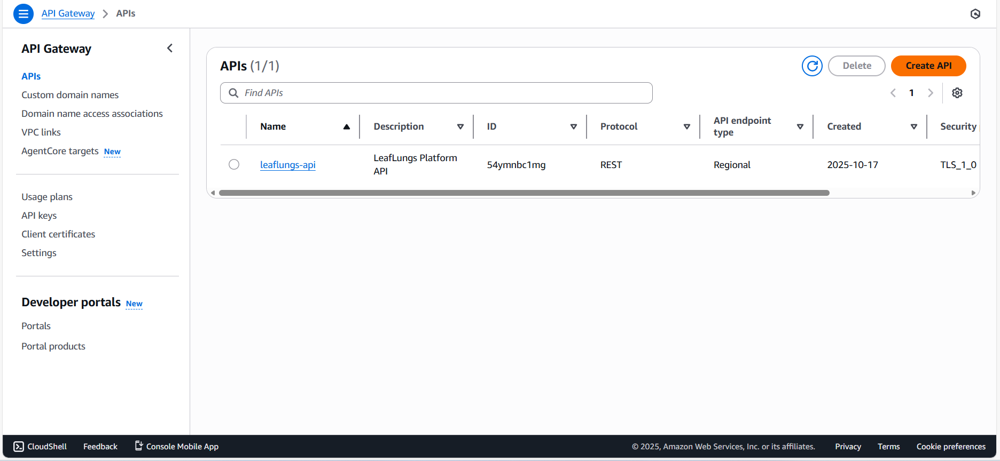
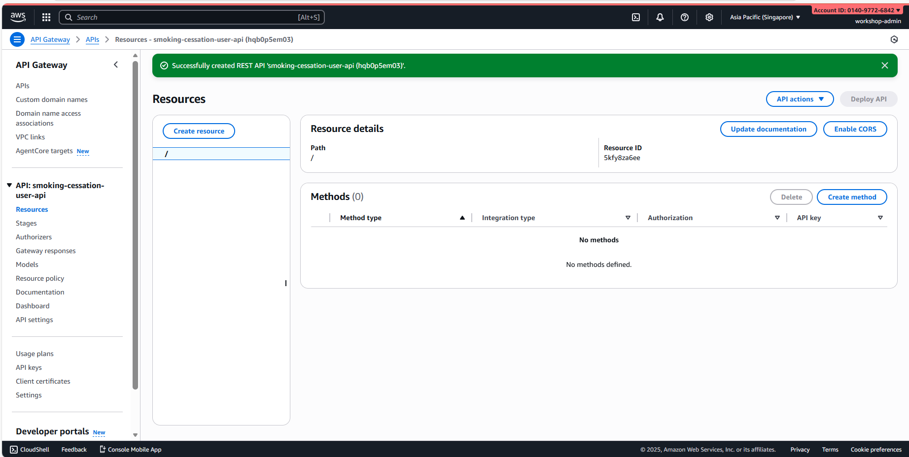
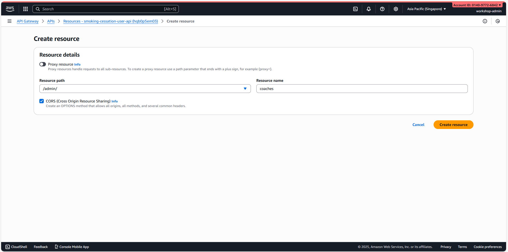

# Module 5: Create API Gateway REST APIs

## Mục tiêu Module

- Tạo 2 REST APIs từ đầu
- Tạo resources & methods
- Integrate với Lambda functions
- Cấu hình authentication & authorization
- Setup CORS & rate limiting
- Deploy & test APIs

**Duration**: 3-4 giờ

---

## API Gateway Overview

2 REST APIs sẽ được tạo:

| API Name | Region | Purpose | Resources | Methods |
|----------|--------|---------|-----------|---------|
| smoking-cessation-user-api | ap-southeast-1 | User management, Admin operations | /admin/coaches, /api/user-info, /upload | GET, POST, PUT, DELETE |
| smoking-cessation-chat-api | ap-southeast-1 | Chat & WebSocket | /chat/rooms, /chat/messages, /ws | GET, POST, WebSocket |

---

## Phần 1: Create First REST API (User Management)

### Bước 1: Truy cập API Gateway Console

1. Login vào AWS Console
2. Tìm kiếm "API Gateway"
3. Click "API Gateway" service
4. Chọn region: **ap-southeast-1**
5. Click "Create API"



### Bước 2: Choose API Type

1. Chọn "REST API"
2. Click "Build"


### Bước 3: Configure API Details

1. **API name**: `smoking-cessation-user-api`
2. **Description**: REST API for user management and admin operations
3. **Endpoint type**: Regional
4. Click "Create API"

⏳ **Chờ API được tạo (khoảng 1-2 phút)**


### Bước 4: View API Dashboard

Sau khi API tạo xong, bạn sẽ thấy:
- Resources tree (currently only "/" root)
- Methods available for root
- Integration settings



---

## Phần 2: Create /admin Resource & /admin/coaches Sub-resource

### Bước 1: Create /admin Resource

1. Click root "/"
2. Click "Create Resource"
3. **Resource name**: `admin`
4. **Resource path**: `/admin`
5. ✅ "Enable API Gateway CORS"
6. Click "Create Resource"


### Bước 2: Create /admin/coaches Sub-resource

1. Click vào `/admin` resource
2. Click "Create Resource"
3. **Resource name**: `coaches`
4. **Resource path**: `coaches` (automatically becomes `/admin/coaches`)
5. ✅ "Enable API Gateway CORS"
6. Click "Create Resource"



### Bước 3: Create GET Method for /admin/coaches

1. Click vào `/admin/coaches` resource
2. Click "Create Method"
3. Select "GET"
4. Click checkmark to confirm


### Bước 4: Configure GET Method Integration

1. **Integration type**: Lambda Function
2. **Lambda Region**: ap-southeast-1
3. **Lambda Function**: `smoking-cessation-admin-manage-coaches`
4. ✅ "Use Lambda Proxy integration"
5. Click "Save"
6. **Confirm** the permission popup


### Bước 5: Create POST Method for /admin/coaches

1. Click "Create Method"
2. Select "POST"
3. Same integration as GET:
   - **Integration type**: Lambda Function
   - **Lambda Function**: `smoking-cessation-admin-manage-coaches`
   - ✅ "Use Lambda Proxy integration"
4. Click "Save"

### Bước 6: Create PUT Method for /admin/coaches

1. Click "Create Method"
2. Select "PUT"
3. Same Lambda integration
4. Click "Save"

### Bước 7: Create DELETE Method for /admin/coaches

1. Click "Create Method"
2. Select "DELETE"
3. Same Lambda integration
4. Click "Save"

**Result**: /admin/coaches now has GET, POST, PUT, DELETE methods

---

## Phần 3: Create /api/user-info Resource & Sub-resources

### Bước 1: Create /api Resource

1. Click root "/"
2. Click "Create Resource"
3. **Resource name**: `api`
4. **Resource path**: `/api`
5. ✅ "Enable API Gateway CORS"
6. Click "Create Resource"

### Bước 2: Create /api/user-info Resource

1. Click vào `/api` resource
2. Click "Create Resource"
3. **Resource name**: `user-info`
4. **Resource path**: `user-info`
5. ✅ "Enable API Gateway CORS"
6. Click "Create Resource"

### Bước 3: Create Methods for /api/user-info

Create GET, POST, PUT, DELETE methods (same as /admin/coaches):

1. For each method:
   - Click "Create Method"
   - Select method type
   - Integration: `smoking-cessation-admin-manage-coaches` Lambda
   - ✅ Lambda Proxy integration
   - Save

### Bước 4: Create /{id} Resource (Path Parameter)

1. Click vào `/api/user-info`
2. Click "Create Resource"
3. **Resource name**: `{id}`
4. **Resource path**: `{id}`
5. Click "Create Resource"

### Bước 5: Create GET Method for /api/user-info/{id}

1. Click vào `/{id}` resource
2. Click "Create Method"
3. Select "GET"
4. Integration: `smoking-cessation-admin-manage-coaches` Lambda
5. Save

### Bước 6: Create /by-user-id Resource

1. Click vào `/api/user-info` (parent)
2. Click "Create Resource"
3. **Resource name**: `by-user-id`
4. **Resource path**: `by-user-id`
5. Click "Create Resource"
6. Add GET method with Lambda integration

### Bước 7: Create /empty Resource

1. Click vào `/api/user-info` (parent)
2. Click "Create Resource"
3. **Resource name**: `empty`
4. **Resource path**: `empty`
5. Click "Create Resource"
6. Add GET method with Lambda integration

**Result**: /api/user-info resource tree created with all sub-resources

---

## Phần 4: Create /upload Resource

### Bước 1: Create /upload Resource

1. Click root "/"
2. Click "Create Resource"
3. **Resource name**: `upload`
4. **Resource path**: `/upload`
5. ✅ "Enable API Gateway CORS"
6. Click "Create Resource"

### Bước 2: Create POST Method

1. Click vào `/upload` resource
2. Click "Create Method"
3. Select "POST"
4. **Integration type**: Lambda Function
5. **Lambda Function**: `smoking-cessation-image-upload`
6. ✅ "Use Lambda Proxy integration"
7. Click "Save"

---

## Phần 5: Configure Authentication & Authorization

### Bước 1: Create Cognito Authorizer

1. Left menu: Click "Authorizers"
2. Click "Create Authorizer"
3. **Authorizer name**: `cognito-user-pool-authorizer`
4. **Type**: Cognito
5. **Cognito User Pool**: `smoking-cessation-users` (tạo ở Module 3)
6. **Token source**: `Authorization`
7. Click "Create authorizer"


### Bước 2: Test Authorizer (Optional)

1. **Token**: (enter a valid JWT token from your Cognito user pool)
2. Click "Test authorizer"
3. Verify response shows user claims

### Bước 3: Add Authorization to Methods

For critical endpoints (e.g., /admin/coaches):

1. Click vào `/admin/coaches` resource
2. Click "GET" method
3. Click "Method Request"
4. **Authorization**: Select `cognito-user-pool-authorizer`
5. Click checkmark to save
6. Repeat for POST, PUT, DELETE methods


---

## Phần 6: Setup Request Validators

### Bước 1: Create Request Validator

1. Left menu: Click "Request Validators"
2. Click "Create"
3. **Name**: `validate-body-and-params`
4. ✅ "Validate request body"
5. ✅ "Validate query string parameters and headers"
6. Click "Create"

### Bước 2: Apply Validator to POST Methods

1. Click vào `/admin/coaches` → "POST" method
2. Click "Method Request"
3. **Request Validator**: Select `validate-body-and-params`
4. Save

---

## Phần 7: Setup CORS

### Bước 1: Enable CORS for All Resources

1. Click root "/"
2. Click "Enable CORS"
3. Review default settings
4. Click "Enable CORS and replace existing CORS headers"


### Bước 2: Configure CORS Headers

CORS headers automatically configured:
- **Access-Control-Allow-Headers**: Content-Type, X-Amz-Date, Authorization, X-Api-Key, X-Amz-Security-Token
- **Access-Control-Allow-Methods**: GET, POST, PUT, DELETE, OPTIONS
- **Access-Control-Allow-Origin**: * (for dev, restrict in production)

---

## Phần 8: Create Second API - Chat API (WebSocket)

### Bước 1: Create WebSocket API

1. Click "Create API"
2. Select "WebSocket API"
3. Click "Build"


### Bước 2: Configure WebSocket API

1. **API name**: `smoking-cessation-chat-api`
2. **Description**: WebSocket API for chat functionality
3. **Route Selection Expression**: `$request.body.action`
4. Click "Create API"

⏳ **Chờ API được tạo**

### Bước 3: Create Routes

Create default routes:

1. **$default** route:
   - Integration: Lambda Function
   - Function: `smoking-cessation-websocket-authorizer`

2. **$connect** route:
   - Integration: Lambda Function
   - Function: `smoking-cessation-websocket-authorizer`

3. **$disconnect** route:
   - Integration: Lambda Function
   - Function: `smoking-cessation-websocket-authorizer`

---

## Phần 9: Deploy APIs

### Bước 1: Create Deployment Stage

For User API:

1. Click "Deploy API"
2. **Stage name**: `prod`
3. **Stage description**: Production environment
4. Click "Deploy"


### Bước 2: Note API Endpoint

After deployment, you'll see:
- **Invoke URL**: `https://{api-id}.execute-api.ap-southeast-1.amazonaws.com/prod`
- Save this URL

### Bước 3: Deploy Chat API

1. Go to Chat API
2. Click "Deploy API"
3. **Stage name**: `prod`
4. Click "Deploy"
5. Note the WebSocket Invoke URL

---

## Phần 10: Test REST API Endpoints

### Bước 1: Test GET /admin/coaches

1. In API Gateway console:
   - Select User API
   - Click `/admin/coaches` → "GET"
   - Click "Test"

2. **Method**: GET
3. **Path**: /admin/coaches
4. **Headers**:
   ```
   Authorization: Bearer {your-cognito-token}
   ```
5. Click "Test"
6. **Expected result**:
   - Status: 200
   - Body: JSON response from Lambda


### Bước 2: Test POST /admin/coaches

1. Click `/admin/coaches` → "POST"
2. Click "Test"
3. **Method**: POST
4. **Headers**:
   ```
   Authorization: Bearer {your-cognito-token}
   Content-Type: application/json
   ```
5. **Body**:
   ```json
   {
     "name": "Coach Name",
     "email": "coach@example.com",
     "specialization": "Smoking Cessation"
   }
   ```
6. Click "Test"
7. **Expected**: Status 200 with created coach data

### Bước 3: Test /upload Endpoint

1. Click `/upload` → "POST"
2. Click "Test"
3. **Method**: POST
4. **Headers**:
   ```
   Authorization: Bearer {your-cognito-token}
   Content-Type: multipart/form-data
   ```
5. Click "Test"
6. **Expected**: Status 200 with S3 URL

### Bước 4: Test with cURL (Optional)

```bash
# Get list of coaches
curl -X GET \
  https://{api-id}.execute-api.ap-southeast-1.amazonaws.com/prod/admin/coaches \
  -H "Authorization: Bearer {token}" \
  -H "Content-Type: application/json"

# Create new coach
curl -X POST \
  https://{api-id}.execute-api.ap-southeast-1.amazonaws.com/prod/admin/coaches \
  -H "Authorization: Bearer {token}" \
  -H "Content-Type: application/json" \
  -d '{
    "name": "Coach John",
    "email": "john@example.com",
    "specialization": "Smoking Cessation"
  }'
```

---

## Phần 11: Setup CloudWatch Logging

### Bước 1: Enable Full Request/Response Logging

1. Click "Settings" (left menu)
2. **CloudWatch log role ARN**:
   - Click "Edit"
   - Select or create IAM role for API Gateway logging
   - Role should have `logs:CreateLogGroup`, `logs:CreateLogStream`, `logs:PutLogEvents` permissions
3. Click "Save changes"

### Bước 2: Set Log Level

1. Go to "Stages" → "prod"
2. Click "Logs"
3. ✅ "Enable CloudWatch Logs"
4. **Log level**: INFO (or DEBUG for troubleshooting)
5. **Data trace enabled**: ✅
6. **Full request/response data**: ✅
7. Click "Save changes"

### Bước 3: View Logs

1. Tìm kiếm "CloudWatch"
2. Click "CloudWatch" service
3. Left menu: "Logs" → "Log groups"
4. Search for `API-Gateway-Execution-Logs_{api-id}`
5. View recent requests


---

## Phần 12: Setup Rate Limiting (Usage Plans)

### Bước 1: Create API Key

1. Left menu: Click "API Keys"
2. Click "Create API Key"
3. **Name**: `mobile-app-key`
4. **Description**: API key for mobile app
5. Click "Create API Key"
6. Copy and save the key

### Bước 2: Create Usage Plan

1. Left menu: Click "Usage Plans"
2. Click "Create"
3. **Name**: `free-tier-plan`
4. **Description**: Free tier plan with rate limiting
5. Click "Next"

### Bước 3: Configure Throttling & Quota

1. **Rate**: 100 requests per second
2. **Burst**: 200 requests
3. **Quota**: 1,000,000 requests per month
4. Click "Next"

### Bước 4: Associate API to Plan

1. **Associated API Stages**:
   - Select User API
   - Select stage: `prod`
2. Click "Next"

### Bước 5: Associate API Key to Plan

1. **API Keys**:
   - Search and select `mobile-app-key`
2. Click "Finish"

---

## Phần 13: Setup Resource-Based Policy (Optional)

To restrict API access to specific IAM users/roles:

### Bước 1: Add Resource Policy

1. Left menu: Click "Resource Policy"
2. Click "Edit"
3. Paste policy:

```json
{
  "Version": "2012-10-17",
  "Statement": [
    {
      "Effect": "Allow",
      "Principal": "*",
      "Action": "execute-api:Invoke",
      "Resource": "execute-api:/*"
    }
  ]
}
```

4. Click "Save"

---

## Phần 14: Enable API Caching (Optional)

### Bước 1: Enable Cache for GET Endpoints

1. Go to stage: "prod"
2. Click "Settings"
3. **Cache cluster enabled**: ✅
4. **Cache cluster size**: 0.5 (smallest)
5. Click "Save changes"

### Bước 2: Configure Cache per Method

1. Click vào `/admin/coaches` → "GET"
2. Click "Integration Response"
3. Expand "200" response
4. **Cache settings**: ✅ "Enable method caching"
5. **Cache time to live (TTL)**: 300 seconds (5 minutes)
6. Click checkmark

---

## Environment Variables Summary

Save these URLs after API deployment:

```env
# User Management API
USER_API_ENDPOINT=https://{api-id-1}.execute-api.ap-southeast-1.amazonaws.com/prod
USER_API_ID={api-id-1}

# Chat API (WebSocket)
CHAT_API_ENDPOINT=wss://{api-id-2}.execute-api.ap-southeast-1.amazonaws.com/prod
CHAT_API_ID={api-id-2}

# Authorizer
COGNITO_AUTHORIZER_ID=cognito-user-pool-authorizer

# Rate Limiting
API_KEY={your-api-key}
```

---

## Checklist

- [ ] User API (smoking-cessation-user-api) created
- [ ] /admin/coaches resource with GET, POST, PUT, DELETE methods created
- [ ] /api/user-info resource with sub-resources created
- [ ] /upload resource with POST method created
- [ ] Chat API (smoking-cessation-chat-api) created
- [ ] Cognito authorizer configured
- [ ] CORS enabled for all resources
- [ ] Request validators configured
- [ ] Both APIs deployed to `prod` stage
- [ ] CloudWatch logging enabled
- [ ] Rate limiting with Usage Plans configured
- [ ] All endpoints tested successfully
- [ ] API endpoints saved to environment variables
- [ ] Sẵn sàng cho Module 6 (Create EC2 Instances & Databases)

---

## Troubleshooting

### CORS Errors in Browser

**Issue**: "Access to XMLHttpRequest blocked by CORS policy"

**Solution**:
1. Verify CORS is enabled for resource
2. Check Access-Control-Allow-Origin header
3. For development, use `*` wildcard
4. For production, restrict to specific domain

### 403 Unauthorized Errors

**Issue**: "User is not authorized to perform: execute-api:Invoke"

**Solution**:
1. Verify JWT token is valid
2. Check authorizer is configured on method
3. Verify user has required role in Cognito
4. Review API resource policy

### Lambda Function Not Found

**Issue**: "Invalid Lambda function ARN specified"

**Solution**:
1. Verify Lambda function exists in same region
2. Check Lambda function name spelling
3. Verify IAM role has Lambda invoke permissions
4. Check CloudWatch logs for integration errors

### Rate Limiting Not Working

**Issue**: "Requests not throttled according to plan"

**Solution**:
1. Verify API key is passed in request
2. Check Usage Plan is associated with stage
3. Verify API key is associated with Usage Plan
4. Wait for throttling to take effect (may take a few minutes)

### High Latency

**Issue**: "API requests taking too long"

**Solution**:
1. Enable caching for GET requests
2. Increase Lambda memory (Module 4)
3. Check database connection from Lambda (Module 6)
4. Monitor CloudWatch metrics

---

## Next Steps

1. Implement API Gateway request/response transformations (optional)
2. Setup WAF (Web Application Firewall) for security (optional)
3. Configure CloudFront for API caching (Module 7)
4. Setup API documentation (optional)
5. Test end-to-end with frontend application

---

## Kết Quả Đạt Được

Sau Module 5, bạn sẽ có:

1. ✅ 2 REST APIs created (User API & Chat API)
2. ✅ All resources & methods configured
3. ✅ Lambda integrations setup
4. ✅ Cognito authorization configured
5. ✅ CORS enabled for all endpoints
6. ✅ Request validators configured
7. ✅ Both APIs deployed to `prod` stage
8. ✅ CloudWatch logging enabled
9. ✅ Rate limiting configured
10. ✅ All endpoints tested & verified
11. ✅ API endpoints documented
12. ✅ Sẵn sàng cho Module 6 (Create EC2 Instances & Databases)
