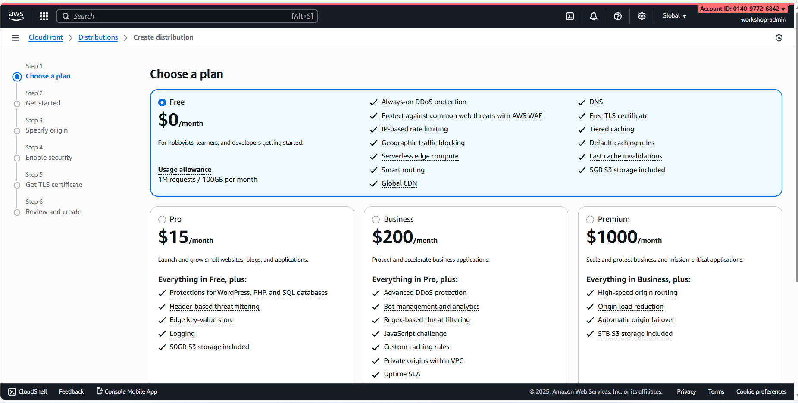

# Module 7: Create S3 Buckets & CloudFront Distribution

## Module Objectives

- Create an S3 bucket for the frontend
- Configure bucket properties & policies
- Create a CloudFront distribution
- Set up Origin Access Control (OAC)
- Configure caching & security
- Deploy the frontend application
- Test access & cache invalidation

**Duration:** 3–4 hours

---

## S3 & CloudFront Overview

You will create **2 S3 buckets** and **1 CloudFront distribution**:

| Component | Name | Region | Purpose |
|-----------|------------------------------|---------------|-----------------------------------------|
| S3 Bucket 1 | smoking-cessation-frontend | us-east-1 | React frontend hosting |
| S3 Bucket 2 | smoking-cessation-backups | ap-southeast-1 | Database backups & logs |
| CloudFront | CF Distribution | Global | CDN for frontend (edge caching) |

---

## Part 1: Create Frontend S3 Bucket

### Step 1: Open S3 Console

1. Log in to the AWS Console  
2. Search for **“S3”**  
3. Click the **S3** service  
4. Click **“Create bucket”**


### Step 2: Configure Bucket Details

1. **Bucket name**: `smoking-cessation-frontend`  
   - Must be globally unique  
   - Use lowercase letters and hyphens only  
2. **Region**: **us-east-1** (required for CloudFront SSL)  
3. **Object Ownership**: ACLs disabled (recommended)  
4. Click **“Create bucket”**

⏳ *Wait a few seconds for the bucket to be created.*


### Step 3: Enable Versioning

1. Open the bucket: `smoking-cessation-frontend`  
2. Go to the **Properties** tab  
3. Scroll to **Versioning**  
4. Click **Edit**  
5. Enable versioning  
6. Click **Save changes**

This enables rollback capability when deploying new frontend builds.

### Step 4: Configure Server Access Logging

1. Still inside the **Properties** tab  
2. Scroll to **Server access logging**  
3. Click **Edit**  
4. Enable logging  
5. **Target bucket**: Create a new bucket  
   - Name: `smoking-cessation-logs`  
6. Click **Save changes**

### Step 5: Enable Static Website Hosting

1. Go to the **Properties** tab  
2. Scroll to **Static website hosting**  
3. Click **Edit**  
4. Enable static website hosting  
5. **Index document**: `index.html`  
6. **Error document**: `index.html` (for SPA routing)  
7. Click **Save changes**


### Step 6: Block Public Access (Required)

1. Go to the **Permissions** tab  
2. Scroll to **Block public access**  
3. Click **Edit**  
4. Make sure all 4 settings are enabled  
5. Click **Save changes**

This ensures the bucket is private and only accessible via CloudFront through OAC.

---


## Part 2: Create Bucket Policy for CloudFront Access

### Step 1: Create Origin Access Control (OAC)

1. CloudFront Console  
2. Left menu: **Origin access control**  
3. Click **Create origin access control**  
4. **Name**: `smoking-cessation-oac`  
5. **Origin type**: S3  
6. **Signing behavior**: Sign requests  
7. Click **Create**

⏳ **Wait for the OAC to be created**

Note the **OAC ID** shown (e.g., `E7DE5EADPNE96`) — you will need this for the S3 bucket policy.

### Step 2: Create Bucket Policy

1. Go to the S3 bucket: `smoking-cessation-frontend`  
2. Click **Permissions** tab  
3. Scroll to **Bucket policy**  
4. Click **Edit**  
5. Paste this policy (replace `OAC_ID` with your real OAC ID):

```json
{
  "Version": "2012-10-17",
  "Statement": [
    {
      "Sid": "AllowCloudFrontOAC",
      "Effect": "Allow",
      "Principal": {
        "Service": "cloudfront.amazonaws.com"
      },
      "Action": "s3:GetObject",
      "Resource": "arn:aws:s3:::smoking-cessation-frontend/*",
      "Condition": {
        "StringEquals": {
          "AWS:SourceArn": "arn:aws:cloudfront::<ACCOUNT_ID>:distribution/<DISTRIBUTION_ID>"
        }
      }
    }
  ]
}
```

6. Click "Save changes"

**Note**: You'll update the distribution ID after creating CloudFront distribution.

---

## Part 3: Create Backups S3 Bucket

### Step 1: Create Second Bucket

1. S3 Console
2. Click "Create bucket"
3. **Bucket name**: `smoking-cessation-backups`
4. **Region**: ap-southeast-1 (same as databases)
5. Click "Create bucket"

### Step 2: Configure Backup Bucket

1. Click into bucket
2. Properties tab
3. **Versioning**: Enable (to keep backup history)
4. **Encryption**: Use server-side encryption
   - Type: AES-256
5. Click "Save changes"

### Step 3: Create Lifecycle Policy (Optional)

To archive old backups after 30 days:

1. Management tab
2. Click "Create lifecycle rule"
3. **Rule name**: `archive-old-backups`
4. **Scope**: Apply to all objects
5. **Transitions**:
   - Transition to Glacier: 30 days
6. **Expiration**: Delete after 90 days
7. Click "Create rule"

---

## Part 4: Create CloudFront Distribution

### Step 1: Go to CloudFront Console

1. Tìm kiếm "CloudFront"
2. Click "CloudFront" service
3. Click "Create distribution"



### Step 2: Configure Origin

1. **Origin domain**: Select `smoking-cessation-frontend.s3.us-east-1.amazonaws.com`
2. **S3 access**: Enable Origin Access Control (OAC)
   - Select: `smoking-cessation-oac` (created in Phần 2)
3. **HTTP version**: HTTP/2 and HTTP/1.1
4. Click "Next"

### Step 3: Configure Default Cache Behavior

1. **Viewer protocol policy**: Redirect HTTP to HTTPS
2. **Allowed HTTP methods**: GET, HEAD, OPTIONS
3. **Cache policy**: CachingOptimized (recommended)
   - TTL: 86400 seconds (1 day) for HTML
   - TTL: 31536000 seconds (1 year) for assets (js, css)
4. **Compress objects automatically**: ✅
5. Click "Next"

### Step 4: Configure Distribution Settings

1. **Enabled**: ✅
2. **Default root object**: `index.html`
3. **Standard logging**: Disabled (use CloudWatch instead)
4. **IPv6**: ✅ Enabled
5. **Comment**: Smoking Cessation Frontend CDN
6. Click "Create distribution"

⏳ **Chờ distribution được tạo & deployed (5-10 phút)**

Deployment status will show "In Progress" → "Deployed"

### Step 5: Note CloudFront Details

After deployment, note:
- **Distribution ID**: (e.g., E1NREZDKTJH6Y9)
- **Domain name**: (e.g., d2yo2hr161ib8h.cloudfront.net)
- **CNAME**: (if custom domain configured)


---

## Part 5: Update S3 Bucket Policy with Distribution ID

### Step 1: Get Distribution ARN

1. CloudFront console
2. Select your distribution
3. Copy **Distribution ID**

### Step 2: Update Bucket Policy

1. Go to S3 bucket: `smoking-cessation-frontend`
2. Permissions → Bucket policy
3. Update the policy with your Distribution ID:

```json
{
  "Version": "2012-10-17",
  "Statement": [
    {
      "Sid": "AllowCloudFrontOAC",
      "Effect": "Allow",
      "Principal": {
        "Service": "cloudfront.amazonaws.com"
      },
      "Action": "s3:GetObject",
      "Resource": "arn:aws:s3:::smoking-cessation-frontend/*",
      "Condition": {
        "StringEquals": {
          "AWS:SourceArn": "arn:aws:cloudfront::<ACCOUNT_ID>:distribution/<YOUR_DISTRIBUTION_ID>"
        }
      }
    }
  ]
}
```

4. Click "Save changes"

---
## Part 6: Configure Custom Domain (Optional)

### Step 1: Request ACM Certificate

**Important**: The ACM certificate must be in the **us-east-1** region for CloudFront!

1. Switch the region to **us-east-1** (top right)  
2. Search for "ACM"  
3. Click **Certificate Manager**  
4. Click **Request certificate**  
5. **Certificate type**: Public certificate  
6. **Domain names**:  
   - `yourdomain.com`  
   - `*.yourdomain.com`  
7. **Validation method**: DNS  
8. Click **Request**

⏳ **Wait for the certificate to be issued**

You will need to validate using DNS CNAME records.

### Step 2: Validate Certificate (DNS Method)

1. Return to ACM certificates  
2. Click on your certificate  
3. Click **Create records in Route 53** (if using Route 53)  
4. Or manually add the CNAME records to your DNS provider  

### Step 3: Add Custom Domain to CloudFront

Once the certificate is validated:

1. Go to your CloudFront distribution  
2. Click **Edit**  
3. **Alternate domain names (CNAMEs)**:  
   - `yourdomain.com`  
   - `www.yourdomain.com`  
4. **Custom SSL certificate**: Select your ACM certificate  
5. Click **Save changes**

### Step 4: Update DNS Records

1. Route 53 or your external DNS provider  
2. Create CNAME records:  
 ```
   yourdomain.com → d2yo2hr161ib8h.cloudfront.net
   www.yourdomain.com → d2yo2hr161ib8h.cloudfront.net
   ```
3. Wait for DNS propagation (up to 24 hours)

---

## Part 7: Configure CORS for S3 (If Needed)

### Step 1: Enable CORS

1. S3 bucket: `smoking-cessation-frontend`
2. Permissions tab
3. Scroll to "CORS"
4. Click "Edit"
5. Paste CORS configuration:

```json
[
  {
    "AllowedHeaders": [
      "Authorization",
      "Content-Length"
    ],
    "AllowedMethods": [
      "GET",
      "HEAD"
    ],
    "AllowedOrigins": [
      "https://yourdomain.com",
      "https://www.yourdomain.com"
    ],
    "ExposeHeaders": [
      "ETag"
    ],
    "MaxAgeSeconds": 3000
  }
]
```

6. Click "Save changes"

---

## Part 8: Build & Deploy Frontend

### Step 1: Build React Application

On your local machine:

```bash
# Navigate to frontend directory
cd /path/to/frontend

# Install dependencies
npm install

# Build production
npm run build

# Output in dist/ or build/ folder
```

### Step 2: Upload to S3

**Option A: Using AWS CLI**

```bash
# Configure AWS credentials
aws configure

# Sync build folder to S3
aws s3 sync dist/ s3://smoking-cessation-frontend/ --delete

# Set index.html to not cache
aws s3 cp s3://smoking-cessation-frontend/index.html s3://smoking-cessation-frontend/index.html \
  --metadata-directive REPLACE \
  --cache-control "max-age=0, no-cache, no-store, must-revalidate"
```

**Option B: Using S3 Console**

1. S3 bucket: `smoking-cessation-frontend`
2. Click "Upload"
3. Select all files from dist/ folder
4. Click "Upload"

### Step 3: Verify Files Uploaded

1. S3 bucket content
2. Should see:
   - index.html
   - assets/
   - *.js, *.css files
   - Other static files


---

## Part 9: Test Frontend Access

### Step 1: Test CloudFront URL

1. Open browser
2. Navigate to `https://<your-cloudfront-domain>.cloudfront.net`
3. Should see your React application loading

### Step 2: Test Custom Domain (If Configured)

1. Navigate to `https://yourdomain.com`
2. Verify page loads properly
3. Check browser console for no errors

### Step 3: Test SPA Routing

1. Navigate to an invalid path (e.g., `/invalid`)
2. Should show 404 from your React app (not AWS 404)
3. This confirms index.html error document is working

### Step 4: Check HTTPS Certificate

1. Click lock icon in browser
2. Verify certificate is valid
3. Hostname matches your domain

---

## Part 10: Setup Cache Invalidation

### Step 1: Create Invalidation via Console

When you deploy new code:

1. CloudFront distribution
2. "Invalidations" tab
3. Click "Create invalidation"
4. **Object paths**:
   ```
   /*
   /index.html
   ```
5. Click "Create invalidation"


### Step 2: Automate Invalidation (Optional)

Create a deployment script:

```bash
#!/bin/bash
# deploy.sh

# Build
npm run build

# Upload to S3
aws s3 sync dist/ s3://smoking-cessation-frontend/ --delete

# Invalidate CloudFront
aws cloudfront create-invalidation \
  --distribution-id E1NREZDKTJH6Y9 \
  --paths "/*"

echo "Deployment complete!"
```

Make executable:
```bash
chmod +x deploy.sh

# Run deployment
./deploy.sh
```

---

## Part 11: Configure Security Headers

### Step 1: Add Response Headers via CloudFront

1. CloudFront distribution
2. "Behaviors" tab
3. Click default behavior
4. Edit → "Response headers policy"
5. Select or create custom policy:
   - **X-Frame-Options**: DENY
   - **X-Content-Type-Options**: nosniff
   - **X-XSS-Protection**: 1; mode=block
   - **Strict-Transport-Security**: max-age=31536000; includeSubDomains
   - **Content-Security-Policy**: default-src 'self'
6. Click "Save changes"

### Step 2: Add Cache Key Policy

For optimal caching:

1. Behaviors tab
2. Click default behavior
3. Edit → "Cache key and origin requests"
4. **Cache policy**: CachingOptimized
5. **Origin request policy**: All ViewerExcept CloudFront-Authorization
6. Click "Save changes"

---

## Part 12: Setup Monitoring & Logging

### Step 1: Enable CloudFront Metrics

1. CloudFront distribution
2. "Monitoring" tab
3. View metrics:
   - Requests (total per time period)
   - Data transferred (GB)
   - Cache hit rate (%)
   - 4xx/5xx error rate
4. Default metrics available (no extra cost)

### Step 2: Create CloudWatch Alarms

For 4xx errors:

1. CloudWatch console
2. "Alarms" → "Create alarm"
3. **Metric**:
   - Namespace: CloudFront
   - Metric: 4xxErrorRate
   - Distribution: Your distribution
4. **Conditions**:
   - Statistic: Average
   - Period: 5 minutes
   - Threshold: > 5%
5. **Notification**: Create SNS topic
   - Topic name: `smoking-cessation-alerts`
   - Email: your@email.com
6. Click "Create alarm"
7. Verify SNS subscription via email

### Step 3: Create CloudFront Dashboard

1. CloudWatch → Dashboards
2. "Create dashboard"
3. **Name**: `smoking-cessation-cdn`
4. Add widgets:
   - CloudFront requests
   - Bytes transferred
   - Cache hit rate
   - Error rates (4xx/5xx)
5. Save dashboard

---

## Environment Variables & URLs

Save these URLs:

```env
# Frontend URLs
FRONTEND_CLOUDFRONT_URL=https://d2yo2hr161ib8h.cloudfront.net
FRONTEND_CUSTOM_DOMAIN=https://yourdomain.com
FRONTEND_BUCKET=smoking-cessation-frontend
FRONTEND_DISTRIBUTION_ID=E1NREZDKTJH6Y9

# Backup S3
BACKUPS_BUCKET=smoking-cessation-backups
```

---

## Checklist

- [ ] Frontend S3 bucket created (smoking-cessation-frontend)
- [ ] Versioning enabled on frontend bucket
- [ ] Static website hosting enabled
- [ ] Public access blocked
- [ ] Backup S3 bucket created (smoking-cessation-backups)
- [ ] Lifecycle policy configured for backups
- [ ] Origin Access Control (OAC) created
- [ ] CloudFront distribution created
- [ ] S3 bucket policy configured with Distribution ID
- [ ] Frontend built & uploaded to S3
- [ ] CloudFront URL accessible via HTTPS
- [ ] Custom domain configured (optional)
- [ ] ACM certificate issued & validated
- [ ] CORS configured if needed
- [ ] Security headers configured
- [ ] Cache invalidation tested
- [ ] CloudWatch monitoring enabled
- [ ] CloudWatch alarms created
- [ ] CloudWatch dashboard created
- [ ] Ready for Module 8 (Create VPC & Security)


---

## Troubleshooting

### CloudFront Shows 403 Forbidden

**Issue**: Getting 403 error when accessing via CloudFront

**Solution**:
1. Verify S3 bucket policy is correct with Distribution ID
2. Verify OAC is properly configured
3. Check CloudFront distribution status (must be "Deployed")
4. Wait 5 minutes for changes to propagate
5. Try cache invalidation: `/*`

### Files Return 404 from S3

**Issue**: Some files return 404 when accessed directly

**Solution**:
1. Ensure all files were uploaded to S3
2. Check file permissions (should be private)
3. Verify index.html exists
4. For SPA, ensure error document is index.html

### SPA Routes Don't Work

**Issue**: Navigating to `/dashboard` returns 404

**Solution**:
1. Verify error document is set to `index.html`
2. This allows React Router to handle routing
3. Invalidate CloudFront cache: `/*`
4. Browser cache: Hard refresh (Ctrl+Shift+R or Cmd+Shift+R)

### Slow Content Delivery

**Issue**: Pages loading slowly

**Solution**:
1. Enable compression in CloudFront (gzip, brotli)
2. Check cache policy TTL
3. Verify assets are in `/assets` folder
4. Monitor CloudFront metrics for cache hit ratio
5. Consider adding more edge locations (available in pricing)

### DNS Resolution Issues

**Issue**: Custom domain not resolving

**Solution**:
1. Verify DNS records created in Route 53
2. Check CNAME points to CloudFront domain
3. Verify ACM certificate is issued & validated
4. Wait for DNS TTL propagation (up to 24 hours)
5. Use `nslookup yourdomain.com` to test

---

## Cost Analysis

**Monthly costs estimate**:
- S3 storage: ~$0.50 (100GB frontend + backups)
- S3 data transfer: ~$2 (to CloudFront)
- CloudFront: ~$2-5 (based on traffic)
- Cache invalidation: ~$0.10 (20 invalidations)
- **Total**: ~$5-8/month (very economical!)

**Cost optimization**:
- Use CloudFront TTL effectively (less invalidations)
- Compress objects in S3
- Use S3 lifecycle policies for backups

---

## Next Steps

1. Integrate frontend with API Gateway endpoints (Module 5)
2. Setup authentication flow with Cognito (Module 3)
3. Configure error boundaries in React
4. Setup analytics (Google Analytics optional)
5. Monitor CloudFront performance metrics

---
## Results Achieved

After Module 7, you will have:

1. ✅ Frontend S3 bucket created & configured  
2. ✅ Backup S3 bucket created with lifecycle policy  
3. ✅ Origin Access Control configured  
4. ✅ CloudFront distribution deployed globally  
5. ✅ HTTPS/SSL certificates configured  
6. ✅ Custom domain configured (optional)  
7. ✅ Frontend application deployed & accessible  
8. ✅ Cache invalidation setup  
9. ✅ Security headers configured  
10. ✅ CORS configuration applied  
11. ✅ CloudWatch monitoring & alarms configured  
12. ✅ CDN optimized for performance  
13. ✅ Ready for Module 8 (Create VPC & Security)
