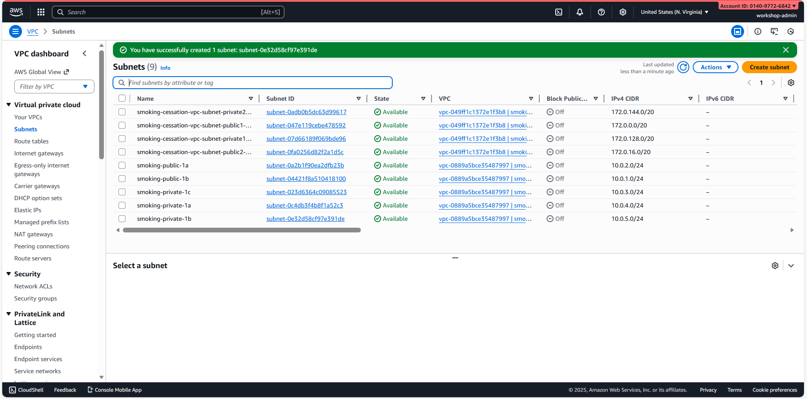
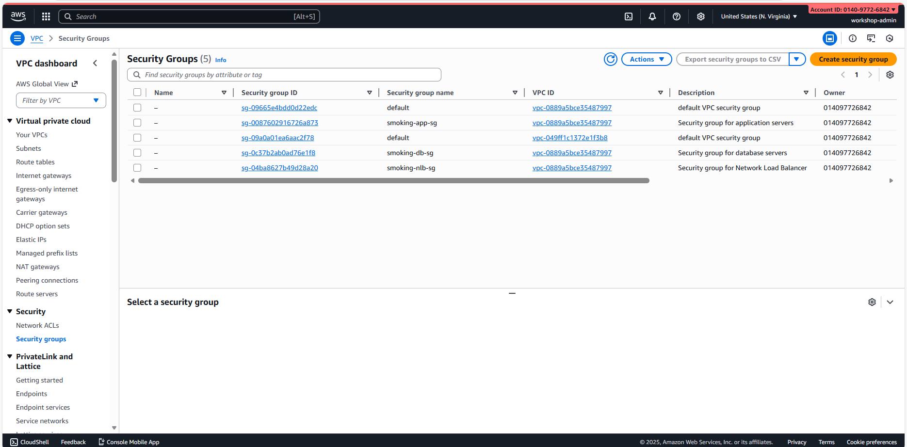

# Module 8: Create VPC, Subnets, Security Groups & NLB

## Module Objectives

- Create a new VPC from scratch  
- Create public & private subnets  
- Configure Internet Gateway & NAT Gateway  
- Create 3 Security Groups  
- Create a Network Load Balancer (NLB) for WebSocket  
- Configure IAM policies  
- Set up VPC Flow Logs & security monitoring  

**Duration**: 4–5 hours

---

## VPC & Network Overview

The VPC architecture will be created in ap-southeast-1:

```
VPC: smoking-cessation-vpc (172.0.0.0/16)
├── Public Subnets (Internet-facing)
│   ├── ap-southeast-1a: 172.0.0.0/24
│   └── ap-southeast-1b: 172.0.1.0/24
├── Private Subnets (Database & Lambda)
│   ├── ap-southeast-1a: 172.0.10.0/24
│   ├── ap-southeast-1b: 172.0.11.0/24
│   └── ap-southeast-1c: 172.0.12.0/24
├── Internet Gateway: smoking-igw
├── NAT Gateway: smoking-nat (in public subnet)
├── NLB: smoking-nlb (WebSocket endpoint)
└── 3 Security Groups:
    ├── smoking-nlb-sg (NLB)
    ├── smoking-app-sg (EC2 Applications)
    └── smoking-db-sg (EC2 Databases)
```
## Part 1: Create VPC

### Step 1: Open VPC Console

1. Log in to AWS Console  
2. Search for "VPC"  
3. Click the "VPC" service  
4. Select region: **ap-southeast-1**  
5. Click **Create VPC**


### Step 2: Configure VPC Details

1. **Name tag**: `smoking-cessation-vpc`
2. **IPv4 CIDR block**: `172.0.0.0/16`
   - Large enough for all subnets (65,536 addresses)
3. **IPv6 CIDR block**: Leave empty  
4. **Tenancy**: Default  
5. Click **Create VPC**

⏳ Wait a few seconds for the VPC to be created


### Step 3: Note VPC Details

After creation, note:
- **VPC ID** (e.g., vpc-049ff1c1372e1f3b8)
- **VPC CIDR**: 172.0.0.0/16

---

## Part 2: Create Internet Gateway

### Step 1: Create IGW

1. VPC Console  
2. Left menu → "Internet Gateways"  
3. Click **Create internet gateway**  
4. **Name**: `smoking-igw`  
5. Click **Create internet gateway**

⏳ Wait for IGW to be created

### Step 2: Attach IGW to VPC

1. Click the newly created IGW  
2. Click **Attach to VPC**  
3. Select VPC: `smoking-cessation-vpc`  
4. Click **Attach internet gateway**


---

## Part 3: Create Subnets

### Step 1: Create Public Subnet 1a

1. VPC Console  
2. Left menu → "Subnets"  
3. Click **Create subnet**  
4. **VPC ID**: `smoking-cessation-vpc`  
5. **Subnet name**: `smoking-public-1a`  
6. **Availability Zone**: **ap-southeast-1a**  
7. **IPv4 CIDR block**: `172.0.0.0/24`  
8. Click **Create subnet**

### Step 2: Create Public Subnet 1b

1. Click **Create subnet**  
2. **Subnet name**: `smoking-public-1b`  
3. **Availability Zone**: **ap-southeast-1b**  
4. **IPv4 CIDR block**: `172.0.1.0/24`  
5. Click **Create subnet**

### Step 3: Create Private Subnet 1a

1. Click **Create subnet**  
2. **Subnet name**: `smoking-private-1a`  
3. **Availability Zone**: **ap-southeast-1a**  
4. **IPv4 CIDR block**: `172.0.10.0/24`  
5. Click **Create subnet**

### Step 4: Create Private Subnet 1b

1. Click **Create subnet**  
2. **Subnet name**: `smoking-private-1b`  
3. **Availability Zone**: **ap-southeast-1b**  
4. **IPv4 CIDR block**: `172.0.11.0/24`  
5. Click **Create subnet**

### Step 5: Create Private Subnet 1c

1. Click **Create subnet**  
2. **Subnet name**: `smoking-private-1c`  
3. **Availability Zone**: **ap-southeast-1c**  
4. **IPv4 CIDR block**: `172.0.12.0/24`  
5. Click **Create subnet**

**Result**: 5 subnets created (2 public + 3 private)



---

## Part 4: Create & Configure Route Tables

### Step 1: Create Public Route Table

1. Left menu → "Route tables"  
2. Click **Create route table**  
3. **Name**: `smoking-public-rt`  
4. **VPC**: `smoking-cessation-vpc`  
5. Click **Create route table**

### Step 2: Add Internet Gateway Route to Public RT

1. Open the public route table  
2. Go to **Routes** → "Edit routes"  
3. Click **Add route**  
4. **Destination**: `0.0.0.0/0`  
5. **Target**: Internet Gateway → `smoking-igw`  
6. Click **Save routes**

### Step 3: Associate Public RT with Public Subnets

1. Go to **Subnet associations** → "Edit subnet associations"  
2. Select:
   - `smoking-public-1a`
   - `smoking-public-1b`
3. Click **Save associations**

### Step 4: Create Private Route Table

1. Click **Create route table**  
2. **Name**: `smoking-private-rt`  
3. **VPC**: `smoking-cessation-vpc`  
4. Click **Create route table**

### Step 5: Associate Private RT with Private Subnets

1. Open the private route table  
2. Go to **Subnet associations** → "Edit subnet associations"  
3. Select:
   - `smoking-private-1a`
   - `smoking-private-1b`
   - `smoking-private-1c`
4. Click **Save associations**

**Note**:  
Private subnets will route internet-bound traffic through the NAT Gateway (configured in the next section).

---
## Part 5: Create NAT Gateway

### Step 1: Create Elastic IP for NAT

1. Left menu: "Elastic IPs"
2. Click "Allocate Elastic IP address"
3. **Region**: ap-southeast-1
4. Click "Allocate"
5. Note the Elastic IP address

### Step 2: Create NAT Gateway

1. Left menu: "NAT Gateways"
2. Click "Create NAT gateway"
3. **Name**: `smoking-nat`
4. **Subnet**: `smoking-public-1a` (place in public subnet)
5. **Elastic IP allocation ID**: Select the IP created in Step 1
6. Click "Create NAT gateway"

⏳ Wait 1–2 minutes until NAT Gateway is created

### Step 3: Add NAT Gateway Route to Private RT

1. Go to "Route tables"
2. Click private route table: `smoking-private-rt`
3. "Routes" tab → "Edit routes"
4. Click "Add route"
5. **Destination**: `0.0.0.0/0`
6. **Target**: NAT Gateway → `smoking-nat`
7. Click "Save routes"

Now private subnets can reach the internet via the NAT Gateway.


---

## Part 6: Create Security Groups

### Step 1: Create NLB Security Group

1. Left menu: "Security Groups"
2. Click "Create security group"
3. **Name**: `smoking-nlb-sg`
4. **Description**: Security group for Network Load Balancer
5. **VPC**: `smoking-cessation-vpc`
6. Click "Create security group"

#### Add Inbound Rules:

1. Click the SG you created
2. "Inbound rules" → "Edit inbound rules"
3. Add:
   - **Type**: HTTPS (443)  
     **Source**: `0.0.0.0/0`
   - **Type**: HTTP (80)  
     **Source**: `0.0.0.0/0`
4. Click "Save rules"

#### Outbound Rules:

- Default allows all traffic ✅

---

### Step 2: Create Application Security Group

1. Click "Create security group"
2. **Name**: `smoking-app-sg`
3. **Description**: Security group for application servers
4. **VPC**: `smoking-cessation-vpc`
5. Click "Create security group"

#### Add Inbound Rules:

1. "Inbound rules" → "Edit inbound rules"
2. Add rules:
   - **Type**: Custom TCP 8000  
     **Source**: `smoking-nlb-sg`
   - **Type**: Custom TCP 22 (SSH)  
     **Source**: My IP or `0.0.0.0/0`
3. Click "Save rules"

#### Outbound Rules:

- Allow all traffic to private subnets & databases

---

### Step 3: Create Database Security Group

1. Click "Create security group"
2. **Name**: `smoking-db-sg`
3. **Description**: Security group for database servers
4. **VPC**: `smoking-cessation-vpc`
5. Click "Create security group"

#### Add Inbound Rules:

1. "Inbound rules" → "Edit inbound rules"
2. Add:
   - **Type**: PostgreSQL (5432)  
     **Source**: `smoking-app-sg`
   - **Type**: Custom TCP 27017 (MongoDB)  
     **Source**: `smoking-app-sg`
3. Click "Save rules"

#### Outbound Rules:

- Default allows all traffic ✅

**Result**: 3 security groups created with correct rules



---

## Part 7: Create Network Load Balancer

### Step 1: Go to Load Balancers

1. Left menu: "Load Balancers" (under EC2)
2. Click "Create load balancer"
3. Select **Network Load Balancer**
4. Click "Create"

### Step 2: Configure NLB Basic Settings

1. **Name**: `smoking-nlb`
2. **Scheme**: **Internet-facing**
3. **IP address type**: IPv4
4. **VPC**: `smoking-cessation-vpc`
5. **Subnets**:
   - `smoking-public-1a`
   - `smoking-public-1b`
6. Click "Next"

### Step 3: Configure Security Groups

1. **Security groups**: Select `smoking-nlb-sg`
2. Click "Next"

### Step 4: Configure Listeners & Routing

1. **Protocol**: TCP  
2. **Port**: 443  
3. **Default action**: Forward to target group  
4. Click **Create target group**

#### Create Target Group:

1. **Name**: `smoking-ws-targets`
2. **Protocol**: TCP
3. **Port**: 8000
4. **VPC**: `smoking-cessation-vpc`
5. **Health check**:
   - Protocol: TCP  
   - Port: 8000  
   - Interval: 30 seconds  
   - Healthy threshold: 2
6. Click "Create"

### Step 5: Register Targets

1. After target group creation, click **Register targets**
2. Add:
   - `smoking-app-user` (port 8000)
   - `smoking-app-social` (port 8000)
3. Click **Register targets**

### Step 6: Review & Create

1. Review configuration
2. Click **Create load balancer**

⏳ Wait 3–5 minutes for NLB provisioning

Note the **NLB DNS name**  
(e.g., `smoking-nlb-123456.elb.ap-southeast-1.amazonaws.com`)


---
## Part 8: Configure NLB with HTTPS/TLS (Optional)

### Step 1: Request ACM Certificate

1. Search for “ACM” (Certificate Manager)
2. Click **Request certificate**
3. **Domain names**:
   - `yourdomain.com` (if using a custom domain)
   - Or use the NLB DNS name
4. **Validation method**: DNS
5. Click **Request**

### Step 2: Create HTTPS Listener

1. Go to the NLB
2. Open the **Listeners** tab → **Add listener**
3. **Protocol**: TLS
4. **Port**: 443
5. **Default action**: Forward to target group `smoking-ws-targets`
6. **SSL certificate**: Select your ACM certificate
7. Click **Add**

### Step 3: Create HTTP → HTTPS Redirect (Optional)

1. Add another listener:
   - **Protocol**: TCP  
   - **Port**: 80  
2. **Default action**: Redirect to port 443 (HTTPS)

---

## Part 9: Configure IAM Policies for Lambda VPC Access

### Step 1: Update Lambda Execution Role

Lambda functions that connect to the database require IAM permissions:

1. Go to IAM Console
2. Click **Roles**
3. Select `smoking-cessation-lambda-role`
4. Click **Add permissions** → **Create inline policy**
5. Select the **JSON** tab
6. Paste the policy:

```json
{
  "Version": "2012-10-17",
  "Statement": [
    {
      "Effect": "Allow",
      "Action": [
        "ec2:CreateNetworkInterface",
        "ec2:DescribeNetworkInterfaces",
        "ec2:DeleteNetworkInterface",
        "ec2:AssignPrivateIpAddresses",
        "ec2:UnassignPrivateIpAddresses"
      ],
      "Resource": "*"
    },
    {
      "Effect": "Allow",
      "Action": [
        "logs:CreateLogGroup",
        "logs:CreateLogStream",
        "logs:PutLogEvents"
      ],
      "Resource": "arn:aws:logs:ap-southeast-1:*:*"
    },
    {
      "Effect": "Allow",
      "Action": [
        "secretsmanager:GetSecretValue"
      ],
      "Resource": "arn:aws:secretsmanager:ap-southeast-1:*:secret:smoking-cessation/*"
    }
  ]
}
```

7. Click "Review policy"
8. **Policy name**: `lambda-vpc-policy`
9. Click "Create policy"

### Step 2: Configure Lambda Functions for VPC

For each Lambda function that accesses databases:

1. Go to Lambda Console
2. Click function name
3. Click "Configuration" tab
4. Click "VPC"
5. Click "Edit"
6. **VPC**: `smoking-cessation-vpc`
7. **Subnets**: Select private subnets
   - `smoking-private-1a`
   - `smoking-private-1b`
8. **Security groups**: `smoking-app-sg`
9. Click "Save"

This allows Lambda to access EC2 database instances.

---

## Part 10: Setup VPC Flow Logs

### Step 1: Enable VPC Flow Logs

1. Go to VPC Console
2. Click "VPCs"
3. Select `smoking-cessation-vpc`
4. Click "Flow logs" tab
5. Click "Create flow log"

### Step 2: Configure Flow Logs

1. **Name**: `smoking-vpc-flow-logs`
2. **Traffic type**: All (capture all traffic)
3. **Log destination**: CloudWatch Logs
4. **Log group name**: `/aws/vpc/smoking-cessation-vpc`
5. **IAM role**: Create new role
   - Role name: `vpc-flow-logs-role`
6. Click "Create flow log"

⏳ **Wait for flow logs to be enabled**


Now all VPC traffic will be logged to CloudWatch!

---

## Part 11: Enable GuardDuty (Threat Detection)

### Step 1: Enable GuardDuty

1. Search "GuardDuty"
2. Click "GuardDuty" service
3. Click "Enable GuardDuty"
4. Read and confirm disclaimer
5. Click "Enable GuardDuty"

⏳ **Wait for GuardDuty to be enabled (a few minutes)**


GuardDuty will analyze VPC Flow Logs for threats.

---

## Part 12: Test Network Connectivity

### Step 1: Test Public Subnet Connectivity

From an EC2 instance in public subnet:

```bash
# Test internet connectivity
ping 8.8.8.8

# Check routing table
route -n

# Should see:
# Destination        Gateway
# 172.0.0.0/16       0.0.0.0 (local)
# 0.0.0.0/0          Internet Gateway
```

### Step 2: Test Private Subnet Connectivity

From an EC2 instance in private subnet:

```bash
# Test NAT Gateway (internet via NAT)
curl https://ip.nslookup.com

# Test database connectivity
psql -h <DB_IP> -U postgres -d smoking_cessation

# Test MongoDB
mongosh --host <MONGO_IP>:27017
```

### Step 3: Test Security Group Rules

```bash
# From app server, test database access
nc -zv <POSTGRES_IP> 5432  # Should be successful
nc -zv <MONGO_IP> 27017    # Should be successful

# From internet, try SSH to app server
ssh -i key.pem ec2-user@<NLB_DNS>  # May timeout (not open for SSH)
```

---

## Environment Variables & Networking Info

Save these for future use:

```env
# VPC
VPC_ID=vpc-046dc916dde2fb93f
VPC_CIDR=172.0.0.0/16

# Subnets
PUBLIC_SUBNET_1A=subnet-xxx
PUBLIC_SUBNET_1B=subnet-xxx
PRIVATE_SUBNET_1A=subnet-xxx
PRIVATE_SUBNET_1B=subnet-xxx
PRIVATE_SUBNET_1C=subnet-xxx

# Gateways
IGW_ID=igw-xxx
NAT_EIP=<elastic-ip>
NAT_GW_ID=nat-xxx

# Security Groups
NLB_SG_ID=sg-xxx
APP_SG_ID=sg-xxx
DB_SG_ID=sg-xxx

# Load Balancer
NLB_DNS=smoking-nlb-123456.elb.ap-southeast-1.amazonaws.com
NLB_ARN=arn:aws:elasticloadbalancing:ap-southeast-1:xxx
```

---

## Checklist

- [ ] VPC created (smoking-cessation-vpc)
- [ ] 5 subnets created (2 public + 3 private)
- [ ] Internet Gateway created & attached
- [ ] Public route table created & configured
- [ ] NAT Gateway created
- [ ] Private route table created & configured with NAT
- [ ] 3 Security Groups created (NLB, App, DB)
- [ ] Security Group rules configured
- [ ] Network Load Balancer created
- [ ] Target group configured with health checks
- [ ] Application targets registered with NLB
- [ ] HTTPS/TLS listener configured (optional)
- [ ] Lambda functions configured for VPC access
- [ ] Lambda IAM policy updated
- [ ] VPC Flow Logs enabled
- [ ] GuardDuty enabled
- [ ] Network connectivity tested
- [ ] Database access from apps verified
- [ ] Ready for Module 9 (CloudWatch Monitoring)

---

## Troubleshooting

### Instances Cannot Access Internet

**Issue**: Private subnet instance cannot reach internet

**Solution**:
1. Verify NAT Gateway is running (not failed)
2. Check private route table has NAT route: `0.0.0.0/0 → NAT Gateway`
3. Verify Elastic IP is allocated
4. Check security group outbound rules

### Lambda Cannot Connect to Database

**Issue**: Lambda timeout when connecting to database

**Solution**:
1. Verify Lambda is in VPC with private subnets
2. Check database security group allows inbound from app SG
3. Verify database instances have correct SG
4. Test from EC2 instance first to isolate issue
5. Check database is actually running

### NLB Health Checks Failing

**Issue**: Target instances marked unhealthy

**Solution**:
1. Verify target group health check port: 8000
2. Verify application listening on port 8000
3. Check security group (NLB-SG → App-SG) allows traffic
4. SSH to instance and test: `curl http://localhost:8000/health`
5. Check application logs for errors

---

## Cost Analysis

**VPC costs** (mostly free, some charges):
- VPC: Free
- Subnets: Free
- IGW: Free
- NAT Gateway: ~$32/month (data processing charge)
- NLB: ~$16/month (hourly) + $0.006 per LCU
- VPC Flow Logs: ~$5/month (CloudWatch Logs storage)
- **Total: ~$50-60/month**

---

## Next Steps

1. Connect EC2 instances to NLB targets
2. Setup auto-scaling groups (optional)
3. Configure CloudFront to front NLB (optional)
4. Setup WAF for NLB (optional)
5. Monitor with CloudWatch (Module 9)

---
## Results Achieved

After completing Module 8, you will have:

- ✅ VPC created with CIDR 172.0.0.0/16  
- ✅ 5 subnets (2 public + 3 private)  
- ✅ Internet Gateway attached  
- ✅ NAT Gateway configured for private subnet internet access  
- ✅ Public and private route tables fully configured  
- ✅ 3 Security Groups with correct inbound/outbound rules  
- ✅ Network Load Balancer successfully deployed  
- ✅ Lambda functions integrated with the VPC  
- ✅ VPC Flow Logs capturing all network traffic  
- ✅ GuardDuty enabled and monitoring threats  
- ✅ Network security architecture fully completed  
- ✅ Ready for Module 9 (CloudWatch Monitoring & Alarms)
